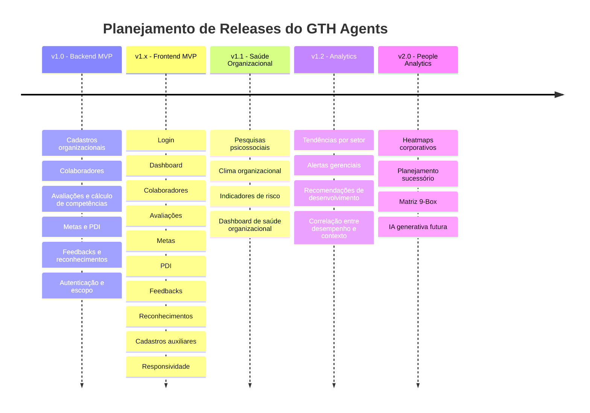

# GTH Agents

Plataforma modular de **Gestão do Talento Humano (GTH)** orientada a dados, desenvolvida para apoiar líderes, profissionais de RH e gestores no acompanhamento de competências, desempenho, desenvolvimento e evolução de colaboradores.

O **GTH Agents** transforma avaliações, metas, feedbacks, reconhecimentos e planos de desenvolvimento em informações estruturadas para apoiar decisões de gestão de pessoas. O objetivo é reduzir a informalidade, criar histórico rastreável e oferecer uma visão mais consistente da evolução dos colaboradores.

---

## Proposta de Valor e Problema Resolvido

Muitas empresas acompanham o desenvolvimento de pessoas por meio de planilhas isoladas, avaliações informais, registros dispersos e decisões baseadas apenas na memória dos líderes.

Esse cenário dificulta:

* identificar competências críticas;
* acompanhar evolução individual;
* registrar feedbacks e reconhecimentos;
* criar planos de desenvolvimento;
* visualizar histórico do colaborador;
* tomar decisões com base em dados minimamente organizados.

O **GTH Agents** busca reduzir esse problema por meio de:

* **Centralização do histórico do colaborador**: reúne avaliações, metas, feedbacks, reconhecimentos e PDIs em uma visão integrada.
* **Medição estruturada de competências**: utiliza competências técnicas, comportamentais, organizacionais e de liderança com pesos configuráveis.
* **Apoio à identificação de perfis de talento**: classifica colaboradores com base em regras de negócio, apoiando decisões de desenvolvimento e acompanhamento.
* **Acompanhamento contínuo**: permite visualizar evolução individual, ações de desenvolvimento, metas e registros de feedback.
* **Controle de acesso por perfil e escopo**: restringe informações conforme o papel do usuário e seu vínculo organizacional.

---

## Pilares Estratégicos do Sistema

O GTH Agents é organizado em pilares de negócio. Os pilares de **Desempenho** e **Desenvolvimento** compõem o escopo atual do MVP, enquanto **Saúde Organizacional** e **Analytics / People Analytics** representam a evolução planejada do produto.

### 1. Desempenho

Focado na avaliação estruturada de competências, desempenho e entregas do colaborador.

Inclui:

* **Competências**: cadastro e organização de competências técnicas, comportamentais, organizacionais e de liderança.
* **Avaliações**: registro de avaliações vinculadas a colaboradores, avaliadores e competências.
* **Cálculo de Competências**: cálculo de médias por tipo de competência, considerando pesos definidos no cadastro.
* **Perfil de Talento**: classificação determinística do colaborador com base em regras de negócio.
* **Metas**: definição e acompanhamento de objetivos individuais.
* **Dashboard**: visão consolidada de indicadores gerais do MVP.

### 2. Desenvolvimento

Focado no crescimento profissional contínuo e no acompanhamento das ações de evolução.

Inclui:

* **PDI (Plano de Desenvolvimento Individual)**: criação de planos e ações de desenvolvimento vinculadas ao colaborador.
* **Feedbacks Estruturados**: registro de feedbacks com contexto, pontos positivos, pontos de melhoria e ações recomendadas.
* **Reconhecimentos Rastreáveis**: registro de reconhecimentos formais com evidência e controle de cancelamento.
* **Evolução do Colaborador**: visão consolidada do histórico do colaborador, reunindo avaliações, perfil, metas, PDIs, feedbacks e reconhecimentos.

### 3. Saúde Organizacional

Pilar planejado para evolução futura do produto.

Deve permitir, em versões posteriores, o acompanhamento de fatores relacionados ao ambiente de trabalho, clima organizacional e riscos psicossociais.

Possibilidades futuras:

* pesquisas psicossociais;
* questionários configuráveis;
* diagnóstico de clima organizacional;
* indicadores de risco psicossocial;
* dashboard de saúde organizacional;
* correlação entre ambiente, desempenho e desenvolvimento.

### 4. Analytics & People Analytics

Pilar planejado para análises avançadas e apoio estratégico à tomada de decisão.

Possibilidades futuras:

* identificação de tendências por setor;
* heatmaps de competências, desempenho e desenvolvimento;
* alertas gerenciais;
* recomendações automáticas para ações de desenvolvimento;
* matriz 9-Box;
* planejamento sucessório;
* uso futuro de IA generativa para recomendações e análises.

---

## Módulos Atualmente Implementados

A versão atual do GTH Agents contempla os seguintes módulos funcionais do MVP:

* **Cadastro Organizacional**: cadastro de setores, funções, competências e usuários.
* **Gestão de Colaboradores**: cadastro, manutenção e consulta de colaboradores.
* **Avaliações e Cálculo de Competências**: registro de avaliações e cálculo de médias por tipo de competência com base nos pesos configurados.
* **Classificação de Perfil de Talento**: agente determinístico baseado em regras de negócio para classificar colaboradores em perfis de talento.
* **Gestão de Metas**: criação e acompanhamento de metas individuais.
* **Planos de Desenvolvimento (PDI)**: criação de planos de desenvolvimento e acompanhamento de ações.
* **Feedbacks**: registro e consulta de feedbacks direcionados aos colaboradores.
* **Reconhecimentos**: registro, listagem e cancelamento de reconhecimentos formais.
* **Evolução Integrada**: visualização consolidada do histórico do colaborador.
* **Dashboard MVP**: visão geral com indicadores consolidados do sistema.
* **Autenticação e Controle de Acesso**: autenticação via JWT com controle por perfil e escopo.

Perfis técnicos atualmente utilizados:

```text
ADMIN
RH
LIDER
COLABORADOR
```

---

## Roadmap do GTH Agents



---

## Arquitetura Geral do Monorepo

O projeto está organizado em um único repositório, separando responsabilidades de backend, frontend e documentação.

```python
gth-agents/
├── backend/            # API REST em Flask estruturada em camadas
├── frontend/           # Aplicação web React/Vite
├── docs/               # Planos, walkthroughs, evidências e documentação auxiliar
├── docker-compose.yml  # Orquestração do ambiente de desenvolvimento
└── README.md           # Visão geral do produto
```

---

## Stack Principal

### Backend

* Python
* Flask
* SQLAlchemy
* Alembic
* PostgreSQL
* PyJWT
* Pytest
* Docker

### Frontend

* React
* Vite
* React Router
* Axios
* Tailwind CSS
* Docker

### Arquitetura e Organização

* Monorepo
* API REST
* Clean Architecture no backend
* Organização por features no frontend
* Autenticação JWT
* Controle de acesso por perfil e escopo
* Documentação por issue, planos de implementação e walkthroughs

---

## Como Executar a Aplicação

### Execução com Docker

Para subir o banco de dados PostgreSQL, a API backend e o frontend:

```bash
docker compose up --build -d
```

Após a inicialização dos serviços, acesse:

* **Frontend**: http://localhost:5173
* **Backend API**: http://localhost:5000
* **Health Check da API**: http://localhost:5000/health

Para aplicar as migrações do banco de dados:

```bash
docker compose exec api alembic upgrade head
```

Para acompanhar os logs dos serviços:

```bash
docker compose logs -f
```

Para encerrar o ambiente:

```bash
docker compose down
```

---

## Execução Local

As instruções detalhadas para execução separada de backend e frontend estão nos READMEs específicos:

* [Backend](backend/README.md)
* [Frontend](frontend/README.md)

---

## Documentação Técnica do Projeto

A documentação evolutiva do projeto está centralizada no diretório `docs/`, incluindo planos de implementação, walkthroughs, evidências e registros de validação por issue.

Documentações principais:

* [Backend](backend/README.md)
* [Frontend](frontend/README.md)
* [Documentações do Projeto](docs/)

Quando disponíveis, contratos de API, autenticação e decisões arquiteturais ficam documentados em `backend/docs/` e nos walkthroughs das respectivas issues.

---

## Observações de Segurança

* O sistema utiliza autenticação via **JWT**.
* O backend aplica controle de acesso por perfil e escopo.
* Os perfis técnicos são `ADMIN`, `RH`, `LIDER` e `COLABORADOR`.
* Informações sensíveis devem ser configuradas por variáveis de ambiente.
* Nunca versionar arquivos `.env` com credenciais reais.
* Usar arquivos `.env.example` como referência de configuração.
* As menções a token, senha e chaves secretas na documentação devem ser apenas conceituais, sem valores reais.

---

## Status Atual

O GTH Agents encontra-se em fase de consolidação do MVP, com backend, frontend, autenticação, controle de acesso, módulos principais de gestão de talentos e documentação evolutiva estruturados.

As próximas fases planejadas incluem:

* consolidação final do frontend MVP;
* módulo de Saúde Organizacional;
* indicadores psicossociais;
* análises avançadas;
* People Analytics;
* recursos futuros de IA generativa.
