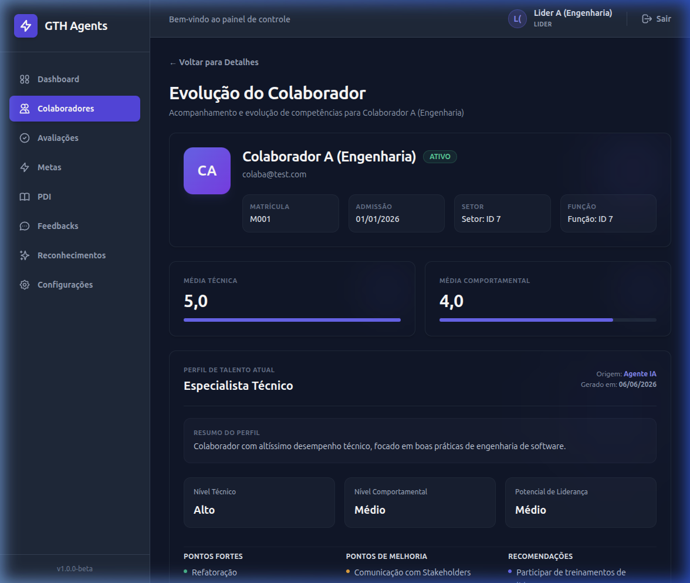
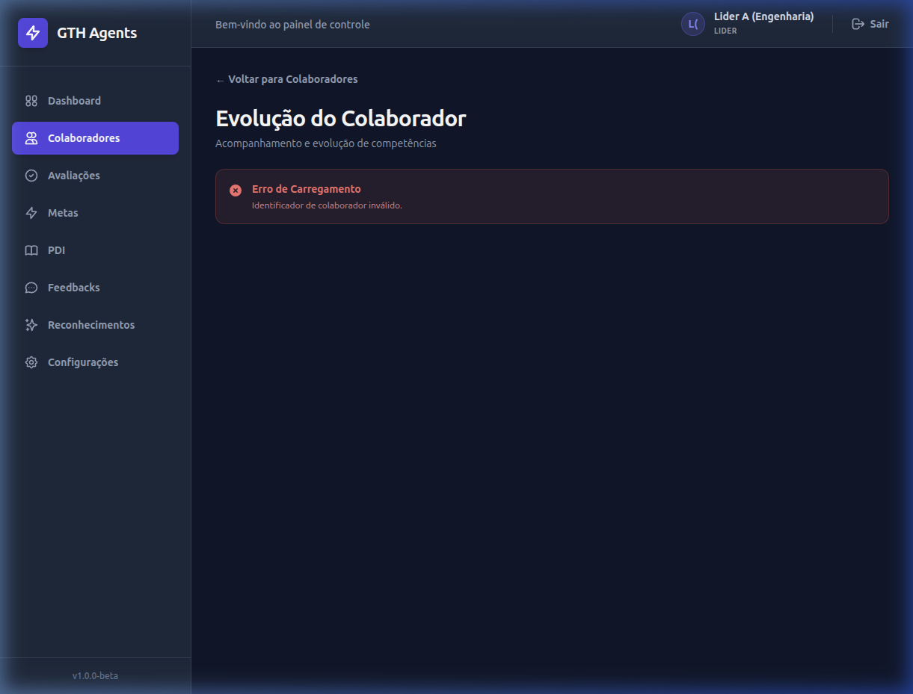
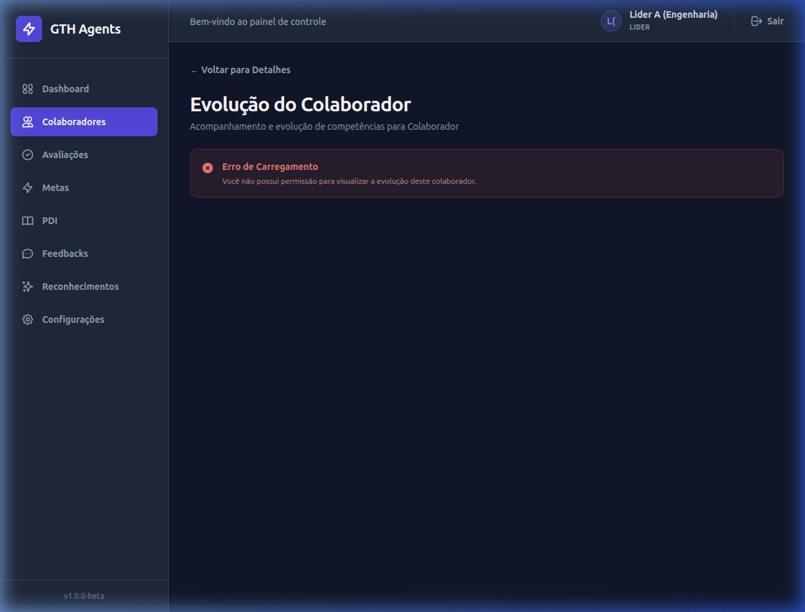

# Walkthrough - Módulo de Evolução do Colaborador (ISSUE #022)

Este walkthrough documenta as evidências de validação, testes estáticos, compilação de produção, validação de containerização e verificação de cenários de borda para a tela de evolução individual do colaborador.

---

## 1. Testes Estáticos (Lint e Compilação)

### 1.1 Execução do Linter
Comando executado a partir do diretório `frontend`:
```bash
cd frontend
npm run lint
```
* **Status:** Sucesso (Exit Code 0)
* **Erros:** 0
* **Avisos:** 0

### 1.2 Execução do Build de Produção
Comando executado a partir do diretório `frontend`:
```bash
npm run build
```
* **Status:** Sucesso (Exit Code 0)
* **Versão do Vite:** v8.0.14
* **Quantidade de Módulos Transformados:** 138 modules transformed
* **Arquivos Principais Gerados:**
  * `dist/index.html` (0.46 kB)
  * `dist/assets/index-CmTsYSHP.css` (23.20 kB)
  * `dist/assets/index-DdS-KkEa.js` (360.66 kB)
* **Tempo do Build:** 796ms

---

## 2. Validação Docker

### 2.1 Validação do Docker Compose

Comando executado na raiz do monorepo:

```bash
docker compose config
```

Resultado:

* configuração validada com sucesso;
* serviço `db` configurado com PostgreSQL;
* serviço `api` configurado a partir de `backend/`;
* serviço `web` configurado a partir de `frontend/`;
* dependência da API em relação ao banco preservada;
* portas `5000` e `5173` publicadas;
* volumes de desenvolvimento configurados;
* nenhuma inconsistência de sintaxe encontrada.

### 2.2 Inicialização (`docker compose up --build`)
* **Frontend Acessível:** Confirmado em `http://localhost:5173`.
* **API Acessível:** Confirmado em `http://localhost:5000`.
* **Autenticação Funcional:** Fluxo de login com tokens JWT devidamente gerados e interceptador injetando o cabeçalho `Authorization: Bearer <token>`.
* **Consumo do Endpoint de Evolução:** Endpoint `/colaboradores/{id}/evolucao` consumido com sucesso (retornando HTTP 200 OK com payload estruturado).

---

## 3. Casos de Teste de Dados

### 3.1 Colaborador com Dados Completos
* **ID Real Utilizado:** `9` (`Colaborador A (Engenharia)`)
* **Evidências no Frontend:**
  * **Perfil Atual:** Exibe "Especialista Técnico", resumo gerado pelo agente de IA, níveis (Técnico: Alto, Comportamental: Médio, Liderança: Médio), pontos fortes ("Refatoração", "Design Patterns", "Arquitetura Limpa"), pontos de melhoria ("Comunicação com Stakeholders") e recomendações.
  * **Indicadores:** Renderiza contadores reais (Feedbacks: 1, PDIs Ativos: 1, Reconhecimentos: 1, Metas: 0/1).
  * **Médias de Competências:** Renderiza Média Técnica `5,0` e Média Comportamental `4,0` com barras de progresso proporcionais.
  * **Avaliações Detalhadas:** Renders Trabalho em Equipe (Nota: 4/5) e Arquitetura de Software (Nota: 5/5) com comentários e badges apropriados.
  * **Metas, PDIs, Feedbacks e Reconhecimentos:** Todos listados no grid com status/prioridades traduzidos e formatados.

### 3.2 Colaborador com Dados Vazios ou Parciais
* **ID Real Utilizado:** `10` (`Colaborador B (Marketing)`)
* **Comportamento no Frontend:**
  * **Perfil Atual:** Identificado como nulo (`perfil_atual = null`) e exibe o estado vazio amigável: `"Sem Perfil de Talento - Este colaborador ainda não possui um perfil de talento gerado pelo sistema."`
  * **Médias de Competências:** Exibe `"Ainda não avaliado"` para Média Técnica e Média Comportamental.
  * **Avaliações, PDIs, Feedbacks e Conquistas vazios:** Exibem mensagens fallbacks (ex: `"Nenhum registro de feedback registrado"`, `"Nenhum reconhecimento registrado"`, etc.).
  * **Dados Parciais:** Renders a única meta existente ("Meta de Marketing 1") e oculta adequadamente as listas vazias com avisos suaves.

### 3.3 Colaborador Inexistente (404)
* **ID Real Utilizado:** `999`
* **Resultado:** O erro é tratado exibindo a mensagem: `"Colaborador não encontrado ou evolução indisponível."`

---

## 4. Casos de Teste de Borda e Segurança

* **ID Inválido Tratado no Frontend:** O acesso a `/colaboradores/abc/evolucao` ou qualquer ID não inteiro/não positivo exibe imediatamente `"Identificador de colaborador inválido."` sem disparar requisições.
* **403 Tratado sem Encerrar Sessão:** Acesso à evolução do colaborador `10` logado como `Lider A (Engenharia)` (fora do escopo do líder) exibe `"Você não possui permissão para visualizar a evolução deste colaborador."` sem deslogar o usuário ou limpar o token JWT. O cabeçalho de navegação e o menu lateral permanecem ativos.
* **Cancelamento de Requisição (Race Conditions):** O uso de `AbortController` cancela requisições ativas ao realizar trocas rápidas de rota ou ao desmontar o componente. Erros do tipo `ERR_CANCELED` são silenciados no bloco `catch` e não alteram o estado de erro/carregamento do componente.
* **Acesso Direto pela URL & Reload:** Funcionamento íntegro ao digitar diretamente a URL da evolução no navegador ou ao atualizar a página.
* **Layout em Viewport Móvel:** Responsividade total testada. O grid se reorganiza em visualização vertical única para dispositivos móveis, e as tabelas e cards colapsam sem quebra de layout ou overflow horizontal.

---

## 5. Robustez de Payload da API

* **Avaliação sem Itens:** Exibe o cabeçalho da avaliação com a mensagem fallback: `"Esta avaliação não possui notas ou itens registrados."`
* **Feedback sem `ponto_melhoria`:** Renders o card de feedback normalmente exibindo `"Não registrado"` na área de melhorias.
* **Indicadores Parcialmente Ausentes:** Tratados de forma defensiva via operador de coalescência nula (`?? 0`), impedindo falhas de rendering se alguma chave do JSON de indicadores não for enviada.
* **Reconhecimento sem campo `ativo`:** O filtro `r.ativo !== false` considera o reconhecimento como ativo (quando `ativo` for `true`, `undefined` ou `null`), mantendo compatibilidade com registros legados do banco.

---

## 6. Mídias e Demonstrações Visuais (Caminhos Relativos)

* **Gravação do Fluxo de Validação:**
  

* **Evolução do Colaborador com Dados Completos:**
  

* **Validação de ID Inválido:**
  

* **Tratamento de Erro 403 (Sem Acesso):**
  

---

## 7. Resultado da Validação

Abaixo está o checklist de validação contendo todos os critérios de aceite atendidos na ISSUE #022:

- [x] O frontend consome o endpoint `GET /colaboradores/{id}/evolucao` de forma segura.
- [x] O ID do colaborador é validado na rota de evolução, impedindo chamadas de API desnecessárias caso seja inválido.
- [x] As médias `0.0` válidas são exibidas como `0,0`, enquanto a mensagem `"Ainda não avaliado"` é restrita a valores nulos/indefinidos ou quando não houver avaliações.
- [x] Coleções de avaliações resumidas (`ultimas_avaliacoes`) e detalhadas (`avaliacoes`) são tratadas separadamente e sem duplicidade.
- [x] Mapeamento defensivo implementado para `feedbacks` (exibição condicional de autor) e `reconhecimentos` (filtragem mantendo suporte a registros legados com chave ativa ausente).
- [x] Resiliência a cancelamento de requisições com `AbortController` prevenindo concorrências e vazamentos de estado ao desmontar componentes.
- [x] Design visual responsivo em conformidade com o sistema de cores escuro, tipografia e espaçamentos do GTH Agents.

---

## 8. Limitações Conhecidas

* **Setor e Função por ID:** Como o contrato de evolução retorna apenas `setor_id` e `funcao_id` no objeto do colaborador, estes valores são renderizados brutos na interface como `"Setor: ID {id}"` e `"Função: ID {id}"`.
* **Sem Alertas:** O bloco de alertas não foi implementado pois a API de evolução não fornece a coleção `alertas` no contrato atual.
* **Sem Ações de PDI:** Apenas as informações básicas do PDI (título, status, prazo, origem) são mostradas na tela de evolução; ações vinculadas não são enviadas pelo endpoint.
* **Sem Data na Avaliação Detalhada:** A coleção `avaliacoes` não possui o campo `data_avaliacao` na raiz dos registros no contrato atual. A interface preserva a ordem retornada pelo backend e omite a data quando nenhum campo temporal estiver disponível.
