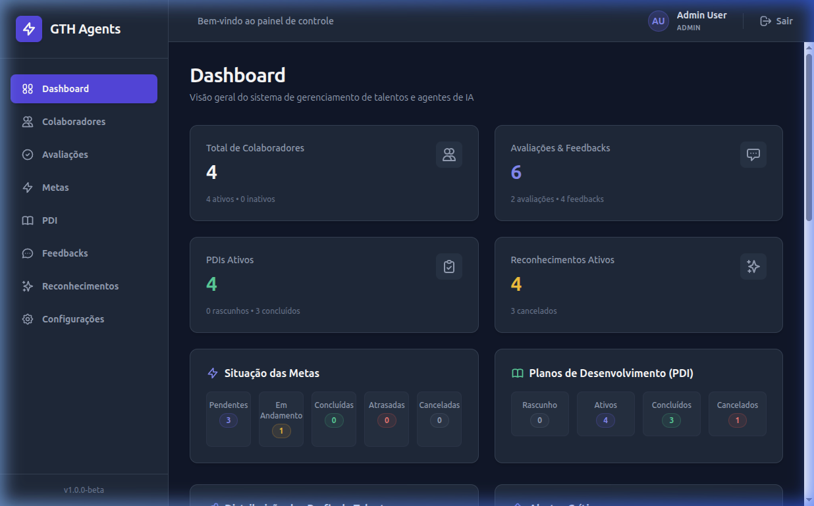
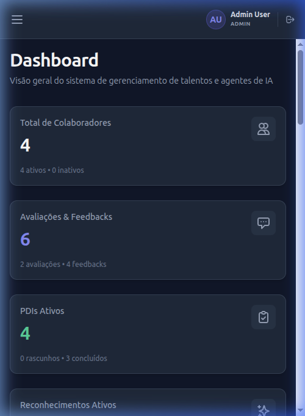
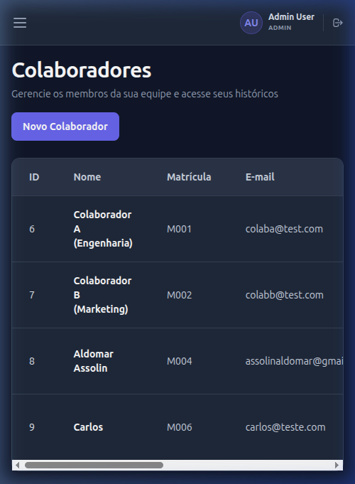
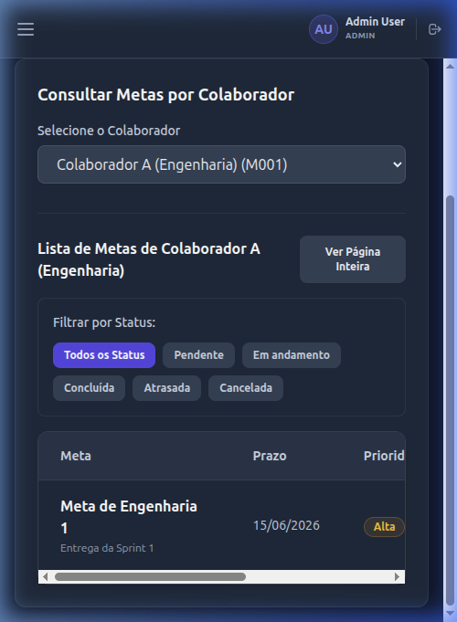
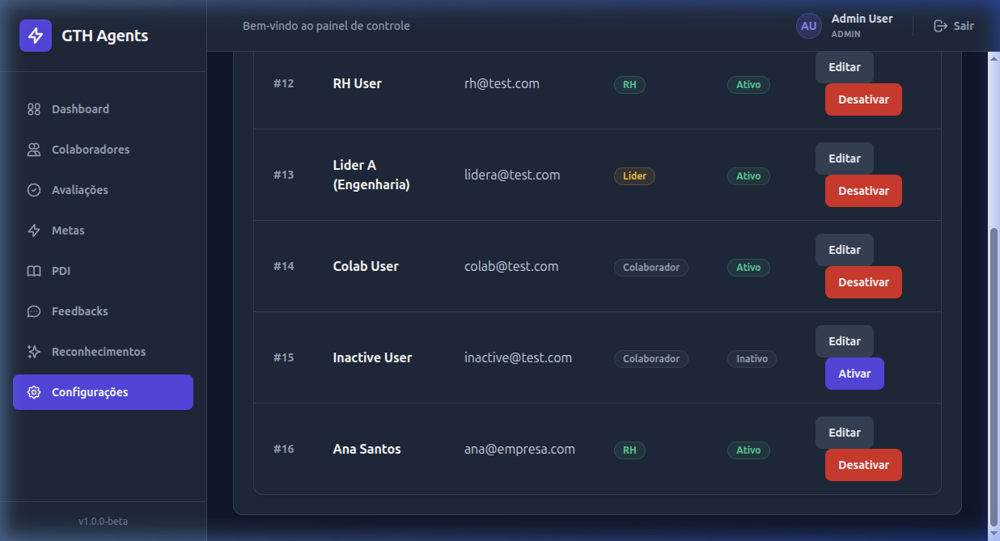

# Walkthrough de Implementação - Melhorar Responsividade e Usabilidade (Issue #038)

Este documento registra a implementação das melhorias de responsividade (mobile-first), usabilidade e consistência visual para o frontend do GTH Agents, bem como os ajustes para remover as limitações de largura em telas grandes.

---

## 1. Escopo das Alterações

O objetivo principal foi adaptar a navegação e a exibição de dados para que a aplicação possa ser utilizada com conforto tanto em telas grandes (Desktop) quanto em tablets e smartphones (Mobile), sem alterar contratos da API do Flask ou a lógica de negócio do frontend.

### Componentes Globais e Layout
*   **AppLayout (`frontend/src/layouts/AppLayout.jsx`):**
    *   Introduziu o estado React `isSidebarOpen` para controlar a visibilidade da gaveta de navegação (Drawer) em telas menores.
    *   Adicionou um backdrop escuro com efeito de desfoque (`backdrop-blur-sm`) que cobre a tela quando a gaveta de navegação é aberta.
    *   Tornou o padding da área principal de conteúdo dinâmico (`p-4 md:p-8`) para maximizar a área útil do conteúdo em dispositivos pequenos.
    *   **Ajuste de Tela Cheia:** Removeu a classe `max-w-7xl` e o alinhamento central `mx-auto` do contêiner `<main>` para permitir que o conteúdo principal (como o Dashboard, PDI e Reconhecimentos) ocupe toda a largura disponível em monitores grandes, eliminando o comportamento "encaixotado".
*   **Sidebar (`frontend/src/components/layout/Sidebar.jsx`):**
    *   Modificou o elemento para ser exibido como um Drawer fixo e deslizante em telas menores que `lg` (1024px) com transições suaves (`transition-transform duration-300`).
    *   Adicionou o botão Close (X) no topo da barra lateral no mobile, com suporte à acessibilidade (`aria-label="Fechar menu"`).
    *   Implementou o fechamento automático do menu de gaveta ao clicar em links de navegação.. (`onClick={onClose}`).
*   **Topbar (`frontend/src/components/layout/Topbar.jsx`):**
    *   Adicionou o botão de menu hambúrguer no lado esquerdo do header, com suporte à acessibilidade (`aria-label="Abrir menu"` e `aria-expanded={isSidebarOpen}`), visível apenas em telas menores (`lg:hidden`).
    *   Ajustou os paddings e os textos para se adaptarem e não estourarem em viewports estreitas de 375px/390px (por exemplo, ocultando o texto "Sair" em telas menores que `sm` e reduzindo o tamanho das iniciais e nome do usuário).

### Componentes Comuns de UI
*   **Card (`frontend/src/components/ui/Card.jsx`):**
    *   Ajustou o padding padrão de `p-6` para um modelo responsivo `p-4 sm:p-6` para liberar mais espaço útil em telas de celulares.
*   **Button (`frontend/src/components/ui/Button.jsx`):**
    *   Aumentou o padding vertical padrão de `py-2` para `py-2.5` na base do botão para garantir uma altura mínima de toque confortável de 40px no mobile.
*   **PageHeader (`frontend/src/components/layout/PageHeader.jsx`):**
    *   Modificou a área de ações do cabeçalho da página para quebrar em múltiplas linhas usando `flex-wrap gap-3` (em vez de `space-x-3`) no celular, impedindo corte ou estouro dos botões.

### Páginas de Tabelas e Grids
*   **Tabelas Responsivas:**
    *   Adicionou restrições de largura mínima (`[&_table]:min-w-[...]`) combinadas com o contêiner `overflow-x-auto` do componente `Table` para criar barras de rolagem horizontais fluidas.
    *   Aplicado a: `MetasTable.jsx`, `PDITable.jsx`, `UsuariosPage.jsx`, `CompetenciasPage.jsx`, `SetoresPage.jsx` e `FuncoesPage.jsx`.

---

## 2. Decisões Técnicas

1.  **Mobile-First com Tailwind Breakpoints:** Toda a lógica de ocultar/mostrar elementos usa os breakpoints padrão do Tailwind CSS (principalmente `lg:hidden`, `lg:translate-x-0` e `lg:static` para gerenciar a transição de sidebar drawer/estático).
2.  **Backdrop Interativo:** Clicar fora do Drawer (no backdrop) dispara o evento `onClose`, melhorando a experiência de navegação ao cancelar a visualização de forma natural.
3.  **Tabelas Roláveis:** Em vez de forçar o espremimento de colunas cruciais em tabelas de dados, foi adotado o padrão de rolagem horizontal focada, garantindo legibilidade completa dos registros e das ações.
4.  **Aproveitamento de Tela Cheia em Desktop:** A remoção de limites artificiais de largura (`max-w-7xl`) permitiu que grades complexas como a do Dashboard e do Mural de Reconhecimentos expandissem naturalmente nas telas desktop, utilizando de forma ótima o espaço sem introduzir barras de rolagem vertical desnecessárias no layout principal.

---

## 3. Arquivos Modificados

```text
docs/frontend/imagens/issue_038_desktop_layout.png
docs/frontend/imagens/issue_038_mobile_dashboard.png
docs/frontend/imagens/issue_038_mobile_colaboradores.png
docs/frontend/imagens/issue_038_mobile_metas.png
docs/frontend/imagens/issue_038_desktop_users.png
docs/frontend/videos/issue_038_responsive_drawer_validation.webp
docs/frontend/implementation-plans/implementation_plan_issue_038_responsividade_usabilidade.md
docs/frontend/walkthroughs/walkthrough_issue_038_responsividade_usabilidade.md
docs/scratchpads/issue-038-manual-validation.md
frontend/src/layouts/AppLayout.jsx
frontend/src/components/layout/Sidebar.jsx
frontend/src/components/layout/Topbar.jsx
frontend/src/components/layout/PageHeader.jsx
frontend/src/components/ui/Card.jsx
frontend/src/components/ui/Button.jsx
frontend/src/features/metas/MetasTable.jsx
frontend/src/features/pdis/PDITable.jsx
frontend/src/pages/UsuariosPage.jsx
frontend/src/pages/CompetenciasPage.jsx
frontend/src/pages/SetoresPage.jsx
frontend/src/pages/FuncoesPage.jsx
```

---

## 4. Validação e Qualidade Técnica

### Lint e Build
*   Executado `npm run lint` no diretório do frontend com **0 erros**.
*   Executado `npm run build` no diretório do frontend com **sucesso**.

### Execução de Containers e Ambiente
*   Os containers Docker (`api`, `web` e `db`) foram levantados em segundo plano via `docker compose up -d`. A disponibilidade foi verificada por inspeção do status dos serviços e acesso às aplicações.
*   Banco de dados populado com sucesso para testes.

---

## 5. Validação Manual Executada

O Scratchpad de validação manual foi criado em:

`docs/scratchpads/issue-038-manual-validation.md`

Os cenários previstos foram executados durante a validação da issue, incluindo:

*   abertura e fechamento da sidebar mobile;
*   fechamento pelo botão X;
*   fechamento pelo backdrop;
*   fechamento ao clicar em item de navegação;
*   validação do layout desktop com sidebar fixa;
*   validação do dashboard em tela mobile;
*   validação de tabelas com rolagem horizontal em telas pequenas;
*   validação das páginas de PDI e Reconhecimentos;
*   validação da ausência de estouro lateral;
*   validação do ajuste de largura livre em telas grandes.

As evidências visuais foram registradas em imagens e vídeo referenciados neste walkthrough.

---

## 6. Limitações Conhecidas

*   As tabelas foram mantidas com rolagem horizontal no mobile, em vez de serem convertidas para cards.
*   Não foram implementados testes automatizados E2E de responsividade.
*   A validação visual foi feita manualmente em resoluções simuladas.
*   Não houve alteração em contratos de API, regras de negócio, autenticação ou permissões.

---

## 7. Evidências Visuais e Demonstração

### Demonstração em Vídeo (Gravação da Validação Manual)
Abaixo está a animação demonstrando o fluxo completo de interação no celular, a abertura do menu hambúrguer, o comportamento do Drawer ao clicar no backdrop ou link e a rolagem horizontal das tabelas:


### Capturas de Tela

#### Interface de Desktop (Sidebar Estática)
No layout desktop, a barra lateral de navegação fica fixa no canto esquerdo e o cabeçalho não exibe o menu hambúrguer, ocupando toda a largura útil disponível:



#### Interface Mobile (Dashboard compactado e adaptado)
Ao encolher a tela para smartphones, a barra lateral some e as métricas do Dashboard se empilham corretamente:



#### Tabela de Colaboradores com Rolagem Horizontal (Mobile)
Tabela de colaboradores scrollável horizontalmente sem quebrar o layout da página:



#### Listagem de Metas com Adaptação de Grids (Mobile)
Tabela de metas do colaborador renderizada com segurança e acessibilidade:



#### Exibição da Lista de Usuários no Painel Administrativo
Visualização da tabela administrativa em resoluções maiores:


