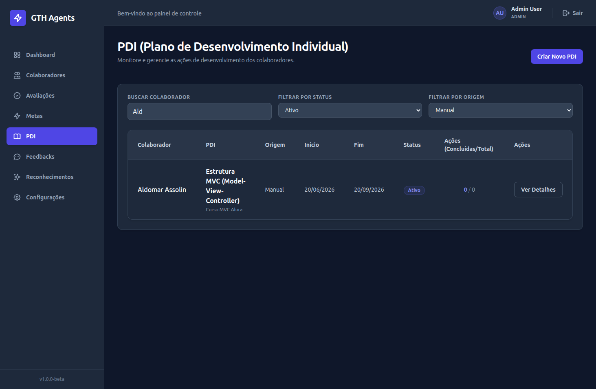
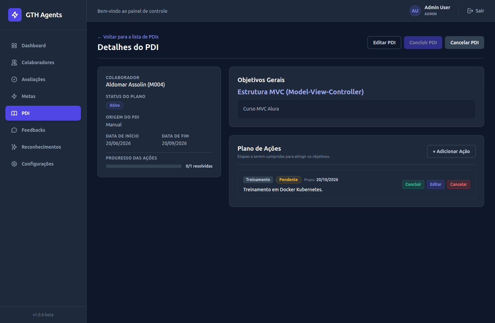
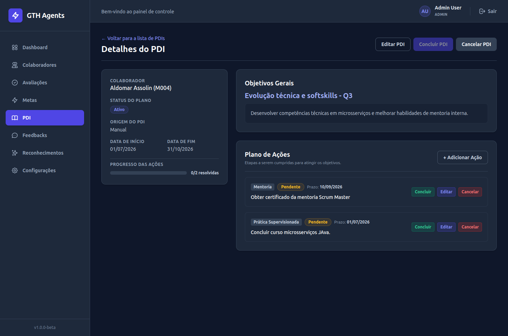
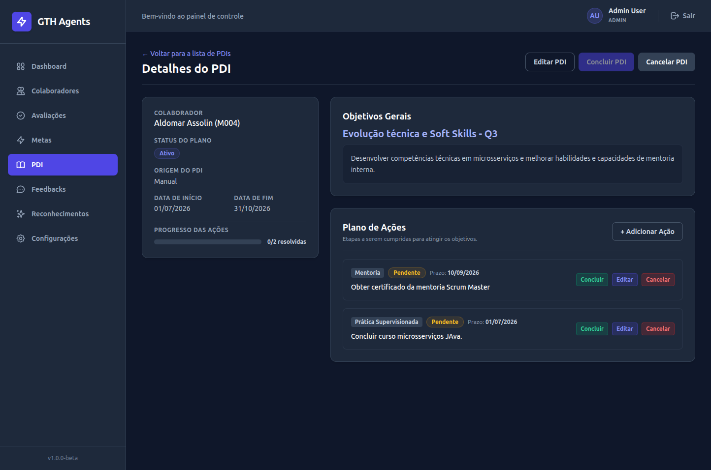
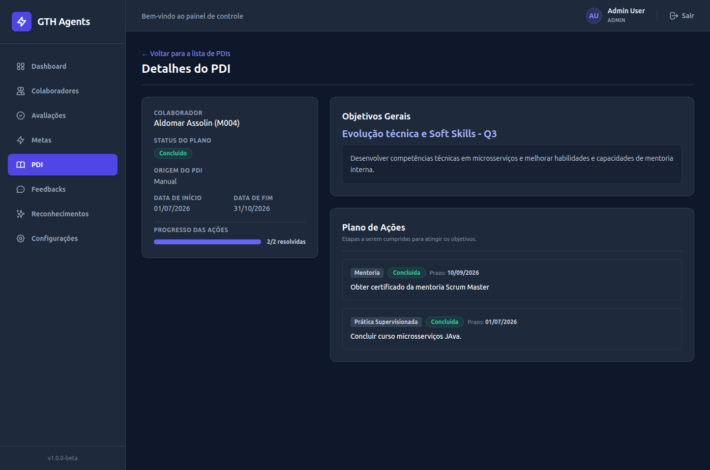
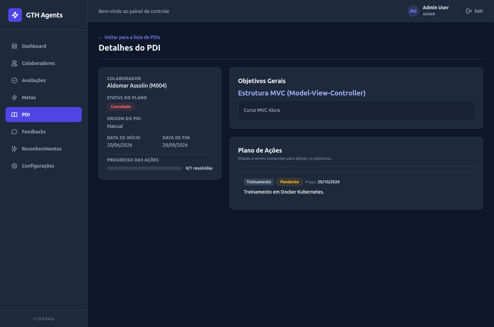
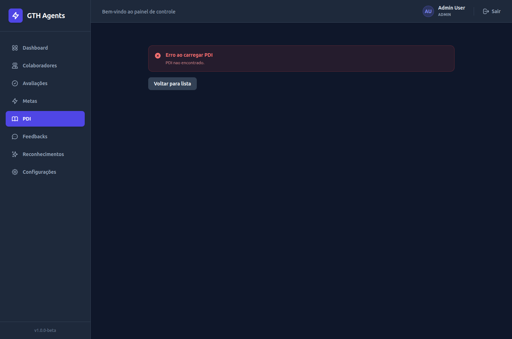
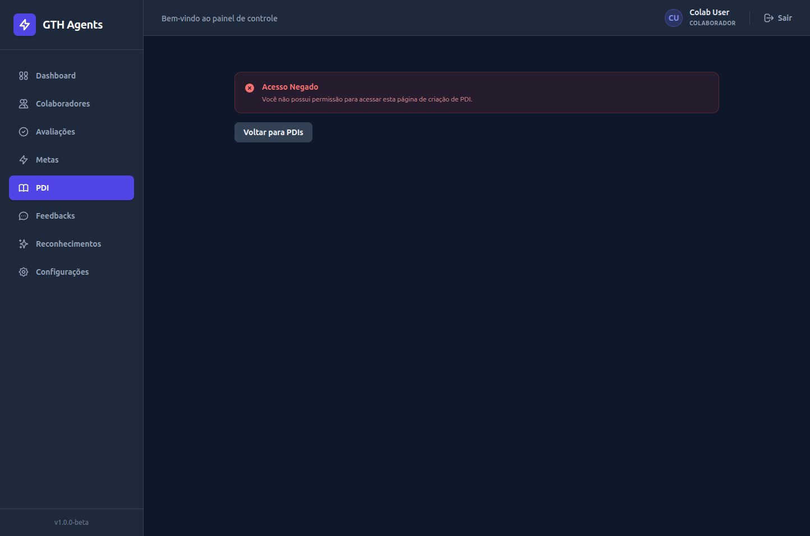

# Walkthrough de Implementação - ISSUE #042 (Módulo PDI)

## Descrição do Objetivo
Implementação completa da interface e integração de dados do módulo de **Plano de Desenvolvimento Individual (PDI)** do GTH Agents (Issue #042), garantindo a conformidade com as regras de negócio, a arquitetura modular baseada em features, pages, components e services no frontend, o escopo de permissões (Líder/RH/Admin vs. Colaborador), e adicionando o suporte a requisições de escrita (`PATCH`) resolvendo bloqueios de CORS do servidor de API.

---

## Estrutura do Monorepo & Arquivos

### Arquivos Criados
*   **Integração e Utilitários do Módulo**:
    *   [pdisService.js](../../../frontend/src/features/pdis/pdisService.js) — Interface com os endpoints da API com suporte a cancelamento via `AbortController`.
    *   [pdisFormatters.js](../../../frontend/src/features/pdis/pdisFormatters.js) — Tradutores e formatadores de status, origens e tipos de ação do PDI.
    *   [pdisErrors.js](../../../frontend/src/features/pdis/pdisErrors.js) — Utilitários de tradução e tratamento amigável de erros da API.
*   **Componentes de Interface (UI)**:
    *   [StatusPDIBadge.jsx](../../../frontend/src/features/pdis/StatusPDIBadge.jsx) — Badge colorido e estilizado para o status do PDI.
    *   [StatusAcaoPDIBadge.jsx](../../../frontend/src/features/pdis/StatusAcaoPDIBadge.jsx) — Badge colorido para o status de cada Ação.
    *   [PDITable.jsx](../../../frontend/src/features/pdis/PDITable.jsx) — Tabela de exibição de PDIs com mapeamento de colaboradores sem N+1.
    *   [PDIForm.jsx](../../../frontend/src/features/pdis/PDIForm.jsx) — Formulário reutilizável de criação e edição com ações dinâmicas.
    *   [PDIsColaboradorView.jsx](../../../frontend/src/features/pdis/PDIsColaboradorView.jsx) — Visão isolada e reutilizável para a listagem dos PDIs de um colaborador específico.
*   **Páginas**:
    *   [NovoPDIPage.jsx](../../../frontend/src/pages/NovoPDIPage.jsx) — Página para criação de novos planos de PDI.
    *   [EditarPDIPage.jsx](../../../frontend/src/pages/EditarPDIPage.jsx) — Página para edição de dados básicos do PDI.
    *   [PDIDetalhePage.jsx](../../../frontend/src/pages/PDIDetalhePage.jsx) — Tela de detalhes, controle de transições de status (Concluir/Cancelar) e gerenciamento local de ações (Adicionar/Editar/Concluir/Cancelar).
    *   [PDIsColaboradorPage.jsx](../../../frontend/src/pages/PDIsColaboradorPage.jsx) — Rota contextualizada para exibir os planos associados a um único colaborador.

### Arquivos Alterados
*   **Rotas e Navegação**:
    *   [AppRoutes.jsx](../../../frontend/src/routes/AppRoutes.jsx) — Registro das novas rotas de PDI.
    *   [ColaboradorDetalhe.jsx](../../../frontend/src/features/colaboradores/ColaboradorDetalhe.jsx) — Ativação dos botões de atalho "Criar PDI" e "Ver PDIs".
*   **Infraestrutura Backend**:
    *   [app.py](../../../backend/app.py) — Adicionado método HTTP `PATCH` no middleware CORS.

---

## Contrato Utilizado & Endpoints

A integração do frontend com o backend consome as seguintes rotas da API:

| Endpoint | Método | Descrição |
|---|---|---|
| `/pdis` | `GET` | Listagem geral de PDIs (retorna PDIs acessíveis conforme perfil do usuário logado). |
| `/pdis` | `POST` | Criação de um novo PDI. |
| `/pdis/{id}` | `GET` | Busca detalhes de um PDI específico e suas ações aninhadas. |
| `/pdis/{id}` | `PATCH` | Edição dos campos gerais (título, descrição, prazos) de um PDI. |
| `/pdis/{id}/concluir` | `PATCH` | Transição de status para `CONCLUIDO`. |
| `/pdis/{id}/cancelar` | `PATCH` | Transição de status para `CANCELADO`. |
| `/colaboradores/{id}/pdis` | `GET` | Busca os PDIs específicos vinculados a um colaborador. |
| `/pdis/{pdi_id}/acoes` | `POST` | Criação de uma ação para o PDI. |
| `/pdis/{pdi_id}/acoes/{acao_id}` | `PATCH` | Atualização (tipo, prazo, descrição) de uma ação. |
| `/pdis/{pdi_id}/acoes/{acao_id}/concluir` | `PATCH` | Conclusão individual da ação. |
| `/pdis/{pdi_id}/acoes/{acao_id}/cancelar` | `PATCH` | Cancelamento individual da ação. |

---

## Decisões Técnicas

1.  **Compatibilidade CORS para PATCH**: Como os módulos anteriores não utilizavam requisições do tipo `PATCH`, a lista de métodos CORS permitidos no backend não incluía este verbo. Adicionou-se `PATCH` na configuração de `backend/app.py` para permitir que o navegador envie essas chamadas sem bloqueios.
2.  **Mapeamento Local de Nomes para Evitar N+1**: A listagem geral de PDIs retorna apenas o ID do colaborador (`colaborador_id`). Para exibir os nomes sem sobrecarregar o backend com requisições redundantes, o componente carrega a lista completa de colaboradores permitidos e cria um mapeamento (`Map`) em memória para resolver o nome em tempo real na listagem global.
3.  **Segurança e Controle de Acesso**: O acesso a rotas de criação/edição é bloqueado no nível visual do frontend para o perfil `COLABORADOR` (ocultando botões e impedindo exibição do formulário). De forma independente, o backend atua como autoridade final de segurança, retornando resposta HTTP 403 (Forbidden) caso uma requisição não autorizada seja submetida.
4.  **Criação Manual Implícita**: Para PDIs criados diretamente pelo frontend, a origem é salva automaticamente como `'MANUAL'`, conforme exigido pelas regras de negócio.
5.  **Validação Dinâmica de Conclusão**: O botão de concluir PDI é dinamicamente desativado no frontend caso restem ações pendentes (`PENDENTE` ou `EM_ANDAMENTO`). Esta validação visual antecipa regras para melhorar a UX, mas o backend permanece como autoridade final para garantir a consistência das regras de negócio.

---

## Validações Executadas

O registro e acompanhamento de todos os cenários manuais têm como fonte o Scratchpad de validação em [docs/scratchpads/issue-042-manual-validation.md](../../scratchpads/issue-042-manual-validation.md), que serve como repositório de evidências funcionais para a Issue #042.

### 1. Validações Automatizadas
*   **ESLint**: Executado `npm run lint` no diretório frontend, finalizado sem erros nem avisos.
*   **Build de Produção**: O empacotamento da aplicação frontend foi concluído com sucesso via `npm run build`.
*   **Docker Compose**: Configuração de containers validada com `docker compose config`.
*   **Testes Backend**: Executada a suíte completa de testes no container backend via comando `docker compose run --rm -e PYTHONPATH=. api pytest`, com 100% de aprovação (126 testes de integração e unitários bem-sucedidos).

### 2. Validações Manuais Executadas pelo Usuário
O usuário executou interações visuais diretamente no navegador, cobrindo os seguintes comportamentos fundamentais do módulo:
*   **Caminho Principal**: Criação de um PDI manual com ação inicial de treinamento, edição de dados básicos do PDI, conclusão/cancelamento de ações individuais e posterior conclusão do PDI principal.
*   **Tratamento de Estados Visuais (Loading e Estado Vazio)**: Validada a tela de carregamento de detalhes e a renderização correta do componente `EmptyState` em colaboradores sem PDI associado (Cenário 12).
*   **Fluxo sem Ações Iniciais**: Criação posterior de ações a partir da tela de detalhes de um PDI ativo (Cenário 4).
*   **Validação de Erros (HTTP 400)**: Tentativa inválida de concluir PDI com ações pendentes, exibindo mensagem amigável no frontend (Cenário 7).
*   **Acesso Direto por URL & Reload (F5)**: Acesso direto a rotas de edição/detalhe e atualização de tela (F5) mantendo os estados e dados recarregados sem falhas (Cenário 3 e Cenário 13).
*   **Restrições Visuais e Segurança**: Ocultamento de botões administrativos e bloqueio visual de acesso para perfil `COLABORADOR` ao tentar carregar rotas restritas via URL direta (Cenário 14 e Cenário 15).

### 3. Verificações no PostgreSQL
As consultas SQL foram executadas manualmente pelo usuário no banco de dados local através do terminal, confirmando a correta escrita e integridade referencial:
```sql
-- Consulta de PDIs
SELECT id, colaborador_id, criado_por_id, titulo, status, origem FROM pdis WHERE id = 6;
-- Retornou: status = 'CONCLUIDO', origem = 'MANUAL', criado_por_id = 11

-- Consulta de Ações do PDI
SELECT id, pdi_id, tipo, status, prazo, descricao FROM acoes_pdi WHERE pdi_id = 6 ORDER BY id;
-- Retornou: Ação #5 CONCLUIDA, Ação #6 CANCELADA
```

### 4. Verificações por Inspeção
*   **Contratos e Rotas**: Verificação estática dos endpoints mapeados em `pdis_routes.py` para sincronizar os métodos com os verbos corretos.
*   **CORS**: Validação do fluxo CORS por meio do comportamento bem-sucedido das requisições `PATCH` no navegador do usuário após a alteração das diretivas CORS no arquivo do backend.

### 5. Cenários Não Executados
Nenhum cenário planejado no Scratchpad ficou pendente de execução. Todos os 16 casos de teste definidos foram integralmente homologados.

---

## Evidências Visuais

As evidências produzidas durante a validação manual estão organizadas em:

*   **Listagem de PDIs com Filtros**:
    

*   **PDI Criado com Sucesso**:
    

*   **Edição de Ação**:
    

*   **Edição de PDI**:
    

*   **Conclusão de PDI**:
    

*   **Cancelamento de PDI**:
    

*   **Tratamento de Erro 404 (Recurso inexistente)**:
    

*   **Bloqueio visual para o perfil COLABORADOR**:
    

---

## Limitações Conhecidas

1.  **Transição para `EM_ANDAMENTO`**: Embora exista suporte interno para o estado `EM_ANDAMENTO` na entidade do domínio, não há um endpoint ou caso de uso público exposto pela API que acione essa transição diretamente a partir do frontend. Por essa razão, a transição não é iniciada pelas ações da interface (que cobrem Concluir e Cancelar), sendo mantido apenas para exibição do status conforme retornado pelo banco.
2.  **Mensagens de Erro 400 restritas a ValidationError e ValueError**: Conforme mapeado no manipulador de erros do backend (`error_handler.py`), apenas exceções do tipo `ValidationError` (erros de regra de negócio/domínio) e `ValueError` (erros de valor Python) são capturadas e normalizadas sob o código HTTP 400. Outros erros herdam seus respectivos códigos de status (ex: 404 para recursos não encontrados e 403 para acessos negados).

---

## Testes Backend

Os testes de integração e unitários foram executados no container backend via comando `docker compose run --rm -e PYTHONPATH=. api pytest`. A suíte completa foi concluída com 126 testes aprovados e nenhuma falha.

```bash
gth-agents-api-run-e559610b766f  | ============================= test session starts ==============================
gth-agents-api-run-e559610b766f  | platform linux -- Python 3.12.13, pytest-8.3.4, pluggy-1.6.0
gth-agents-api-run-e559610b766f  | rootdir: /app
gth-agents-api-run-e559610b766f  | plugins: cov-7.1.0
collected 126 items                                                            
gth-agents-api-run-e559610b766f  | 
gth-agents-api-run-e559610b766f  | tests/test_access_scope.py .............                                 [ 10%]
gth-agents-api-run-e559610b766f  | tests/test_auth_and_access_control.py ..........                         [ 18%]
gth-agents-api-run-e559610b766f  | tests/test_cadastros_basicos.py ......                                   [ 23%]
gth-agents-api-run-e559610b766f  | tests/test_colaboradores_crud.py .                                       [ 23%]
gth-agents-api-run-e559610b766f  | tests/test_competency_calculation.py .......                             [ 29%]
gth-agents-api-run-e559610b766f  | tests/test_dashboard_mvp.py .................                            [ 42%]
gth-agents-api-run-e559610b766f  | tests/test_evolucao_colaborador.py ..................                    [ 57%]
gth-agents-api-run-e559610b766f  | tests/test_migracao_servicos.py ...                                      [ 59%]
gth-agents-api-run-e559610b766f  | tests/test_pdi.py ....................                                   [ 75%]
gth-agents-api-run-e559610b766f  | tests/test_reconhecimentos.py ...................                        [ 90%]
gth-agents-api-run-e559610b766f  | tests/test_talent_classification.py .........                            [ 97%]
gth-agents-api-run-e559610b766f  | tests/test_usuario_security.py ...                                       [100%]
gth-agents-api-run-e559610b766f  | 
gth-agents-api-run-e559610b766f  | ======================== 126 passed in 62.75s (0:01:02) ========================
gth-agents-api-run-e559610b766f exited with code 0
```

## Resultado Final

*   **Status do Módulo**: `IMPLEMENTAÇÃO E VALIDAÇÕES CONCLUÍDAS`
*   **Resultado da Validação**: `APROVADO`
*   **Ações do Git**: Pronto para integração (sem commits ou merges automáticos executados).
