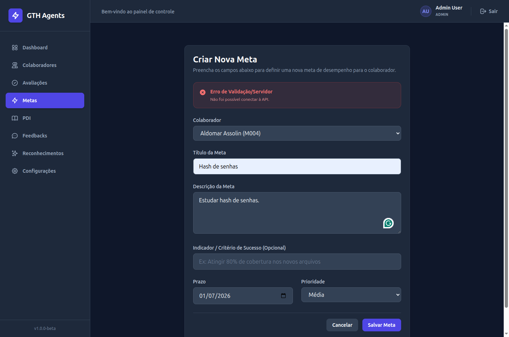
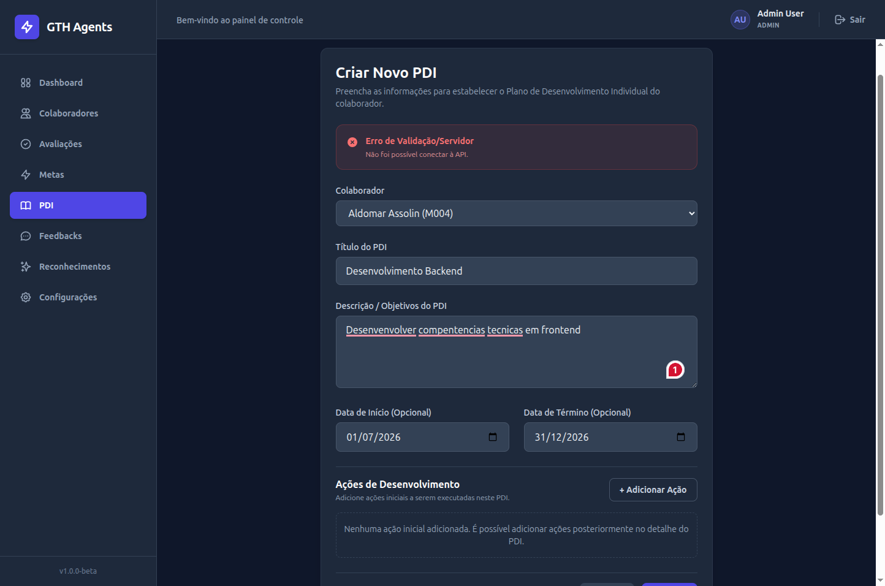
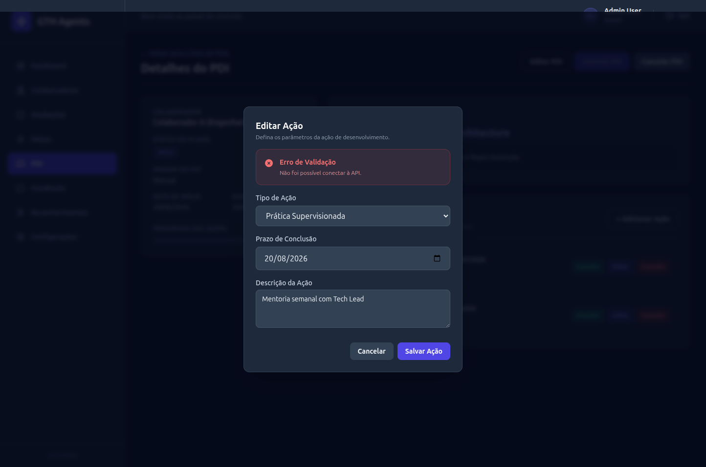
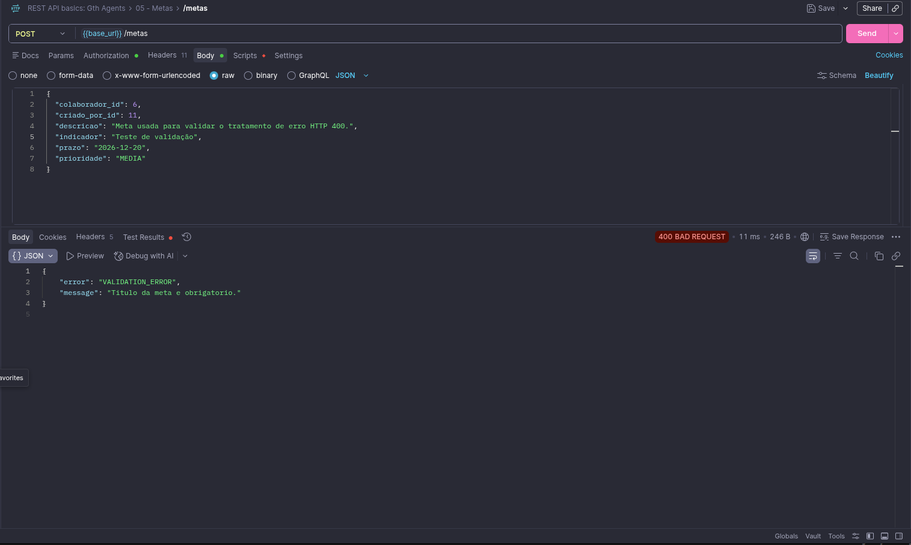
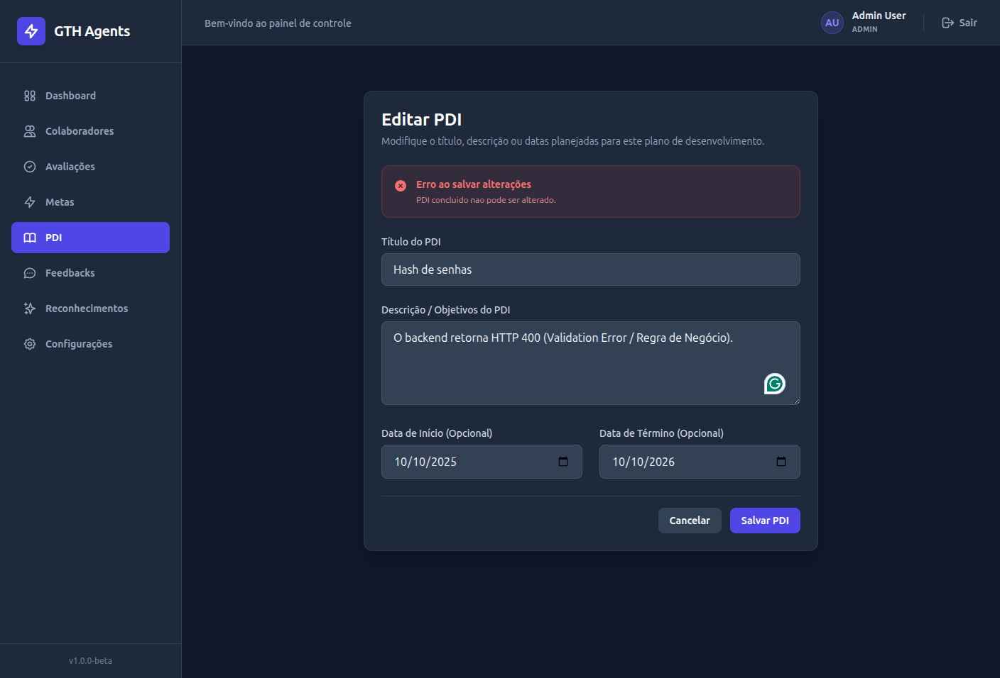
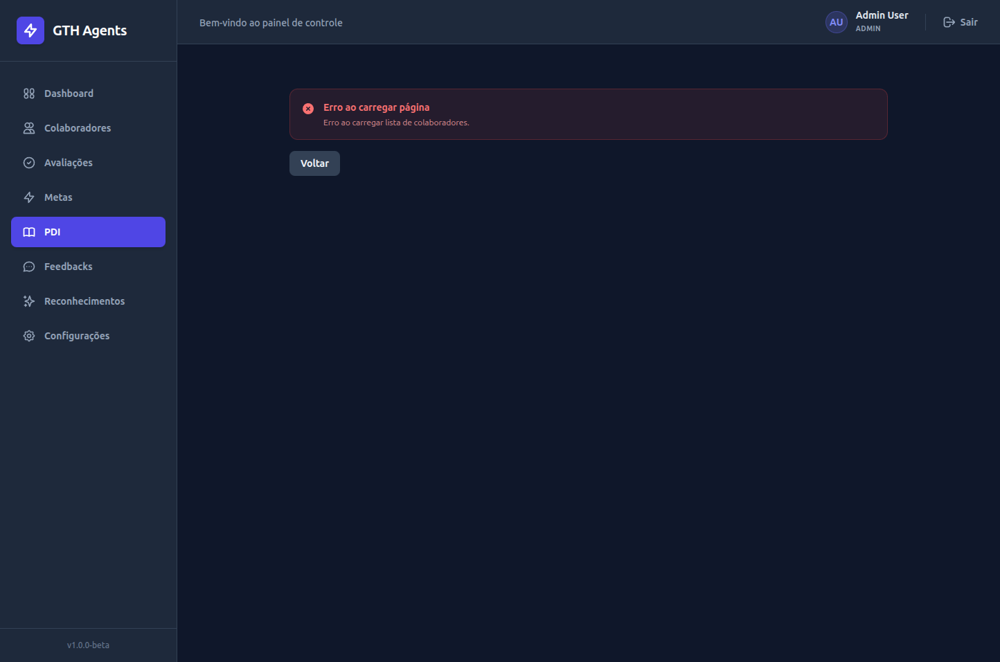

# Walkthrough de Implementação - ISSUE #068 (Padronização de Erros em Formulários)

## Descrição do Objetivo
O objetivo desta issue foi normalizar e robustecer a gestão de estados de erro de formulário no frontend do GTH Agents (páginas `NovaMetaPage`, `NovoPDIPage`, `EditarPDIPage` e o componente `AvaliacaoForm`).
Bugs da categoria P2 causavam a desmontagem total do formulário e a consequente perda de dados digitados em caso de falhas na submissão (como erro de rede ou validação do backend). Para solucionar isso, separamos o estado genérico de erro em duas responsabilidades isoladas:
1.  **`loadError` (Erro de Carregamento)**: Trata apenas de falhas que impedem a renderização inicial e montagem segura da página (ex: indisponibilidade da API ao buscar a lista de colaboradores). Interrompe a exibição do formulário em favor de uma tela cheia de erro amigável.
2.  **`submitError` (Erro de Submissão)**: Trata de erros ocorridos na tentativa de envio dos dados preenchidos (HTTP 400, 403 ou falhas de rede). Mantém o formulário montado na tela com os dados preenchidos intactos, exibindo um banner de erro vermelho localizado e reativando o botão de envio após a falha.

---

## Estrutura do Monorepo & Arquivos

### Arquivos Alterados
*   **Páginas**:
    *   [NovaMetaPage.jsx](../../../frontend/src/pages/NovaMetaPage.jsx) — Separado o estado de erro inicial de colaboradores (`loadError`) do estado de erro no envio da meta (`submitError`). Ajustado o fluxo de submissão para reabilitar o botão de envio e resetar erros prévios.
    *   [NovoPDIPage.jsx](../../../frontend/src/pages/NovoPDIPage.jsx) — Refatoração idêntica para o fluxo de criação de PDI, mantendo o formulário montado e as ações adicionadas intactas sob falhas na API.
    *   [EditarPDIPage.jsx](../../../frontend/src/pages/EditarPDIPage.jsx) — Implementado o controle isolado de erros no fluxo de edição (`PATCH`) de PDI, preservando os campos modificados do formulário.
*   **Componentes de Interface (UI)**:
    *   [AvaliacaoForm.jsx](../../../frontend/src/features/avaliacoes/AvaliacaoForm.jsx) — Remoção de código morto (`errors.submitError`) que não possuía produtor na lógica do formulário de avaliações.

### Documentação Técnica e Validação
*   [issue-068-manual-validation.md](../../../docs/scratchpads/issue-068-manual-validation.md) — Scratchpad contendo o planejamento de testes de carregamento, submissão, falha de rede e validação da API, além do registro de evidências do usuário.

---

## Contrato Utilizado & Endpoints

| Endpoint | Método | Descrição |
|---|---|---|
| `/metas` | `POST` | Criação de meta (retorna HTTP 201 em sucesso ou HTTP 400 em falhas de validação, tais como a falta de campos obrigatórios). |
| `/pdis` | `POST` | Criação de PDI (retorna HTTP 201 em sucesso ou HTTP 400 em erros de preenchimento). |
| `/pdis/{id}` | `PATCH` | Atualização de dados de um PDI (sujeito às regras de estado do PDI; retorna HTTP 200 em sucesso ou HTTP 400 caso o PDI esteja concluído ou cancelado). |

---

## Decisões Técnicas

1.  **Isolamento de Estado**: O estado `error` foi desmembrado em `loadError` e `submitError`. O componente do formulário (ex: `PDIForm` ou `MetaForm`) é montado se e somente se `loadError` estiver vazio. Qualquer falha na submissão altera apenas o estado `submitError`, exibindo o erro em uma seção dedicada sem forçar a desmontagem da árvore de renderização.
2.  **Persistência Visual de Dados**: Ao delegar o estado de erro de submissão para um banner superior e manter o formulário montado, o estado interno de cada input (controlado pelos hooks do React) é mantido, assegurando a persistência completa dos dados que o usuário digitou.
3.  **Reset de Estado na Nova Submissão**: Ao chamar `handleSubmit`, a primeira ação executada é limpar erros de submissão anteriores (`setSubmitError("")`), garantindo que o banner suma da tela no instante em que a nova tentativa inicia.
4.  **Liberação de Controles**: O fluxo de carregamento/salvamento (`isSubmitting`) é gerenciado em blocos `try/catch/finally` para que o botão de salvar seja destravado mesmo após falhas de rede, indisponibilidade da API ou respostas de erro.

---

## Validações Executadas

O processo de homologação seguiu a metodologia do Scratchpad de Validação Manual em [issue-068-manual-validation.md](../../../docs/scratchpads/issue-068-manual-validation.md).

### 1. Validações Automatizadas (Antigravity)
*   **ESLint**: Executado `npm run lint` no diretório frontend, finalizado sem erros nem avisos.
*   **Vite Build**: O empacotamento da aplicação para produção foi concluído com sucesso via `npm run build`.
*   **Git Formatação**: Verificado `git diff --check`, atestando que nenhuma linha contém espaços em branco no final ou formatações inconsistentes.
*   **Testes Automatizados Frontend**: Não existem testes automatizados no frontend aplicáveis a esta issue (como testes unitários ou de integração de componentes).

### 2. Validações Manuais e de Negócio (Usuário)
Os testes foram realizados diretamente no navegador do ambiente local:
*   **Erro de Rede na Submissão (Cenários 1, 2 e 3)**: Com o backend desligado, as telas `/metas/novo`, `/pdis/novo` e `/pdis/{id}/editar` mantiveram todos os inputs preenchidos, não desmontaram a página e exibiram a mensagem de erro de conexão com o botão de salvamento destravado.
*   **Cenário 4 - Erro de Validação da API - Meta**:
    *   **Validação da API via Postman**: Foi enviada uma requisição sem o campo obrigatório `titulo`. O backend retornou HTTP 400 com a mensagem `"Titulo da meta e obrigatorio."`.
    *   **Validação Visual do Frontend**: Para avaliar a renderização do erro de submissão do formulário React, realizou-se um teste instrumental comentando temporariamente a validação de título em `MetaForm.jsx` para permitir o envio do formulário vazio. A página permaneceu montada exibindo o alerta de erro sem perda de dados. A validação local foi restaurada logo após o teste.
*   **Erro de Validação da API - PDI (Cenário 5)**: Testou-se a regra de estado do PDI provocando um conflito de estado entre abas (abrindo a edição em uma aba e concluindo o PDI em outra aba). A tentativa de salvar alterações na aba de edição retornou HTTP 400 (`"PDI concluido nao pode ser alterado."`) e a tela de edição renderizou o banner vermelho mantendo o formulário ativo.
*   **Limpeza Automática (Cenário 6)**: Confirmado que ao re-submeter um formulário, o erro de conexão anterior desaparece imediatamente no clique do botão. A segunda tentativa (com backend ativo) foi concluída com sucesso sem a necessidade de reload da página.

---

## Evidências Visuais

As evidências foram coletadas e organizadas na pasta de imagens do projeto:

*   **Erro de Conexão na Criação de Meta (Cenário 1)**:
    

*   **Erro de Conexão na Criação de PDI (Cenário 2)**:
    

*   **Erro de Conexão na Edição de PDI (Cenário 3)**:
    

*   **Validação HTTP 400 na Criação de Meta (Cenário 4)**:
    

*   **Validação HTTP 400 na Edição de PDI - Conflito de Estado (Cenário 5)**:
    

*   **Recarregamento Seguro e Erro de Inicialização da API (Cenário 6 - HMR / Offline)**:
    

---

## Limitações Conhecidas
1.  **Limitação natural do estado local após reload ou remontagem do componente**: Se a página inteira sofrer reload ou o componente for remontado (por exemplo, devido a um hot reload do Vite ou ação manual enquanto a API backend estiver offline), o estado local de submissão (`submitError`) e os dados digitados são reiniciados, e os hooks de inicialização dispararão um `loadError` na nova montagem, o que é o comportamento correto e esperado do ciclo de vida do componente.

---

## Resultado Final

*   **Status do Módulo**: `VALIDAÇÃO TÉCNICA E MANUAL CONCLUÍDAS`
*   **Resultado da Validação**: `APROVADO`
*   **Pronto para Fechamento**: `SIM`
