# Validação Manual - GTH Agents (Issue #040 - Reconhecimentos)

Este documento registra o plano de testes funcionais para o módulo de reconhecimentos do GTH Agents. Os testes devem ser executados pelo homologador humano.

---

### Cenário 1: Listagem Global (Mural)
- **Perfil**: ADMIN ou RH
- **Pré-condições**: Existência de reconhecimentos cadastrados no sistema.
- **IDs utilizados**: N/A
- **Passos**:
  1. Efetuar login com usuário ADMIN/RH.
  2. Navegar para a página `/reconhecimentos` utilizando o menu lateral.
  3. Visualizar a listagem de reconhecimentos no mural.
- **Resultado esperado**: Todos os reconhecimentos cadastrados no sistema devem ser exibidos com seus respectivos badges de tipo, status, descrição e autoria.
- **Resultado observado**: O Mural de reconhecimentos apresenta os cards de reconhecimentos de todos os colaboradores cadastrados no sistema.
- **Status**: APROVADO
- **Evidências**:
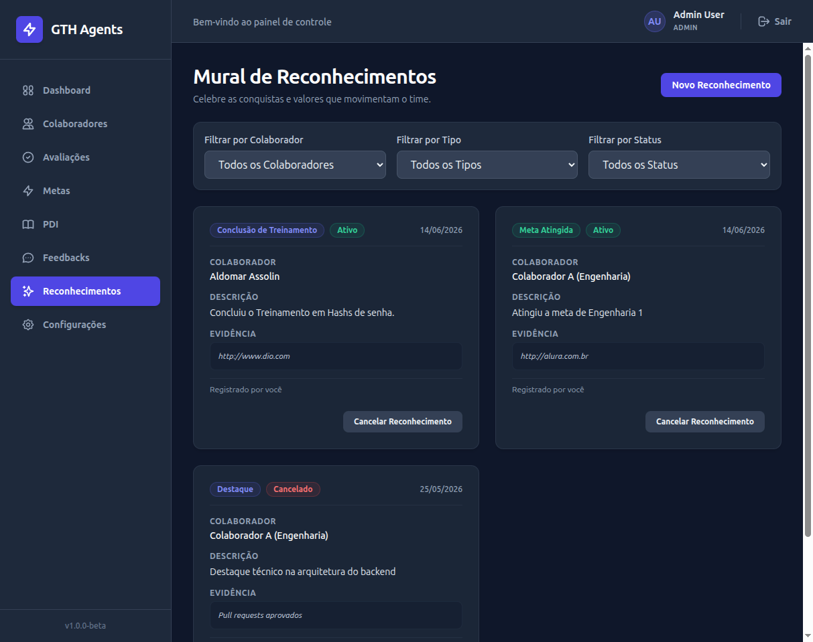

- **Observações**: N/A

---

### Cenário 2: Listagem Contextual
- **Perfil**: LIDER, ADMIN ou RH
- **Pré-condições**: O colaborador selecionado possui reconhecimentos ativos ou cancelados cadastrados.
- **IDs utilizados**: ID de um colaborador com histórico.
- **Passos**:
  1. Acessar a página `/colaboradores`.
  2. Escolher o colaborador e acessar a tela de detalhes.
  3. Clicar no atalho "Ver Reconhecimentos".
- **Resultado observado**: A tela exibe apenas os reconhecimentos do colaborador selecionado.
- **Status**: APROVADO
- **Evidências**:
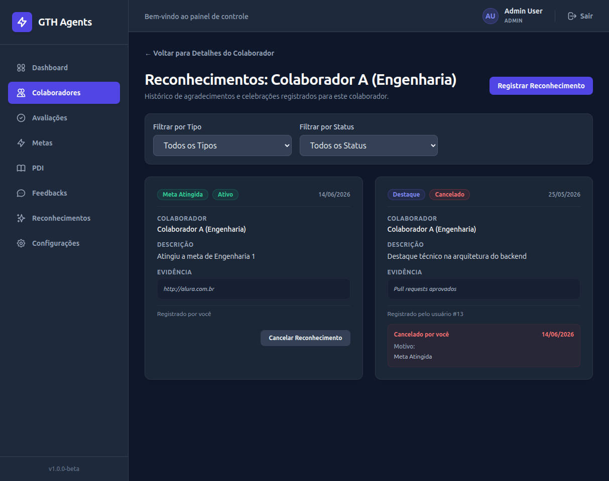
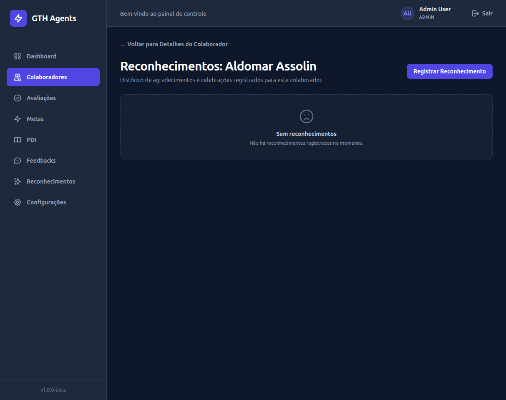
- **Observações**: N/A

---

### Cenário 3: Criação de Reconhecimento
- **Perfil**: LIDER, ADMIN ou RH
- **Pré-condições**: Usuário autenticado e com permissão de criação.
- **IDs utilizados**: ID de colaborador sob liderança do usuário (se líder) ou qualquer colaborador (se ADMIN/RH).
- **Passos**:
  1. Acessar `/reconhecimentos/novo`.
  2. Selecionar o colaborador no campo de dropdown.
  3. Escolher o tipo de reconhecimento.
  4. Digitar uma descrição e uma evidência nos campos correspondentes.
  5. Clicar em "Salvar".
- **Resultado esperado**: O reconhecimento deve ser criado com sucesso, redirecionando o usuário para o resumo da criação ou para a listagem onde o card criado deve aparecer.
- **Resultado observado**: O reconhecimento foi criado com sucesso e a página foi redirecionada para o Mural de Reconhecimentos
- **Status**: APROVADO
- **Evidências**: 
- **Observações**: N/A

---

### Cenário 4: Query String Válida na Criação
- **Perfil**: LIDER, ADMIN ou RH
- **Pré-condições**: Colaborador solicitado é válido e está sob o escopo de visualização do usuário.
- **IDs utilizados**: ID de colaborador válido.
- **Passos**:
  1. Acessar diretamente a URL `/reconhecimentos/novo?colaborador_id=<ID_VALIDO>`.
- **Resultado esperado**: O dropdown de colaboradores deve pré-selecionar o colaborador com o ID informado e o campo deve permanecer bloqueado (desabilitado).
- **Resultado observado**: O dropdown de colaborador é inicializado com o valor do colaborador solicitado via parâmetro e o campo de selecionar o colaborador está desabilitado.
- **Status**: APROVADO
- **Evidências**:
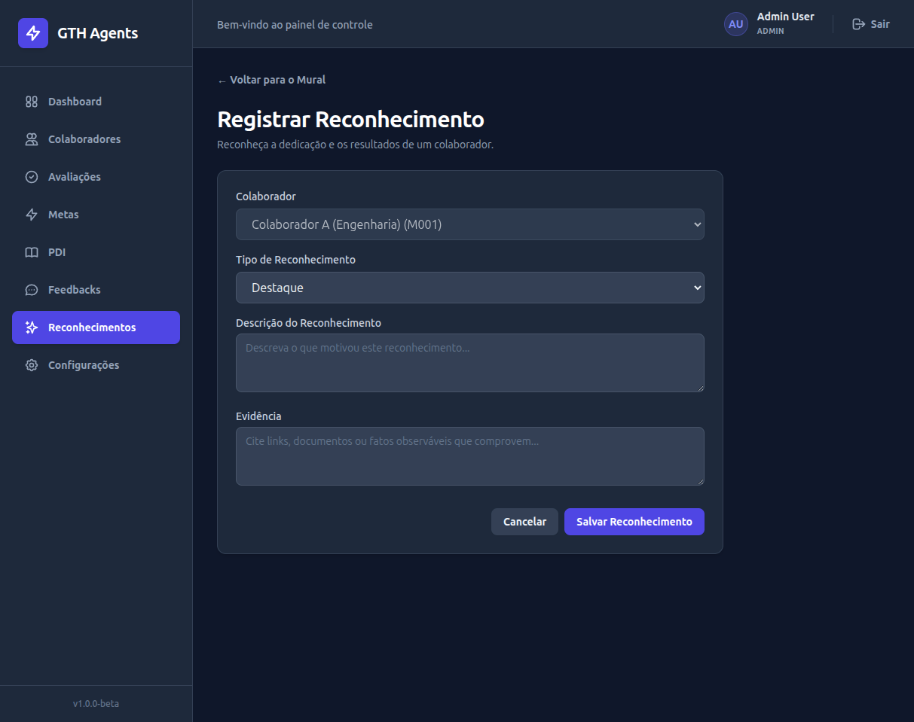
- **Observações**: N/A

---

### Cenário 5: Query String Inválida na Criação
- **Perfil**: LIDER, ADMIN ou RH
- **Pré-condições**: ID fornecido na URL é inexistente ou pertence a um colaborador fora do escopo do usuário.
- **IDs utilizados**: ID inexistente (ex: `9999`) ou fora de escopo.
- **Passos**:
  1. Acessar diretamente a URL `/reconhecimentos/novo?colaborador_id=<ID_INVALIDO>`.
- **Resultado esperado**: O dropdown de colaborador deve permanecer destravado, inicializar com valor padrão vazio ("Selecione...") e um aviso contextual em tela deve alertar o usuário: *"O colaborador solicitado via parâmetro não foi encontrado ou está fora do seu escopo de acesso."*
- **Resultado observado**: O campo colaborador é inicializado com o valor padrão vazio ("Selecione..."), aparece uma mensagem acima do form indicando que o colaborador solicitado via parâmetro não foi encontrado ou está fora do escopo de acesso, é possível interagir com o campo Colaborador. O botão de salvar fica habilitado.
- **Status**: APROVADO
- **Evidências**:
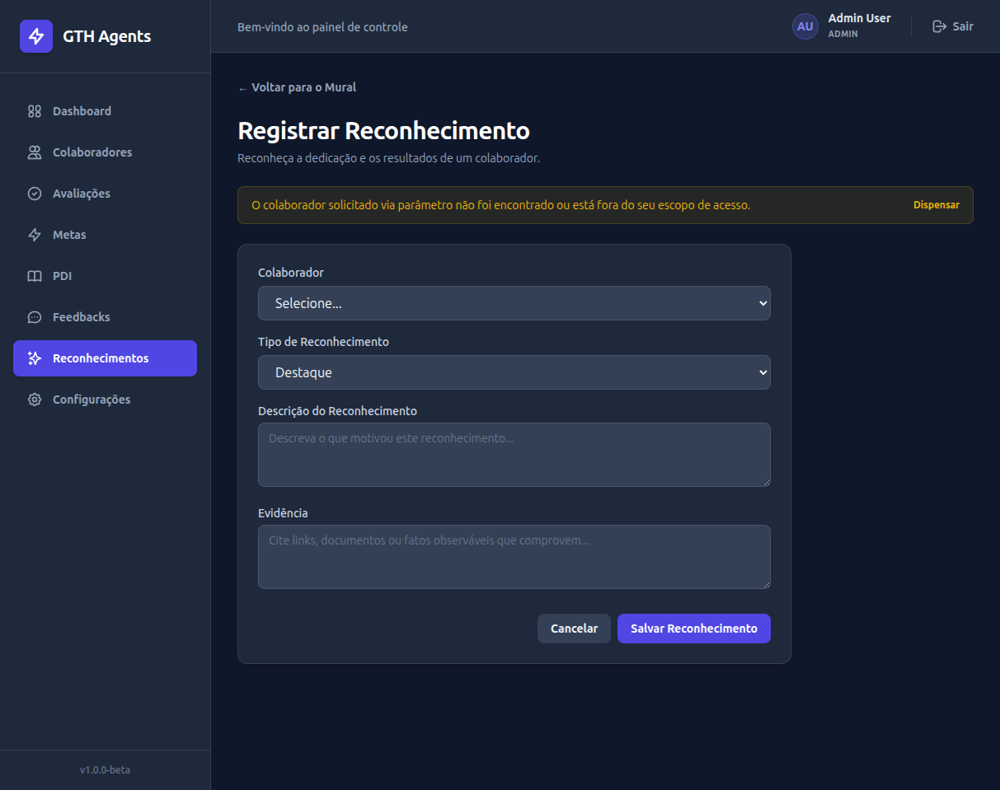
- **Observações**: N/A

---

### Cenário 6: Campos Obrigatórios
- **Perfil**: LIDER, ADMIN ou RH
- **Pré-condições**: N/A
- **IDs utilizados**: N/A
- **Passos**:
  1. Acessar `/reconhecimentos/novo`.
  2. Deixar campos obrigatórios (tipo, descrição, evidência) vazios.
  3. Tentar submeter o formulário clicando em "Salvar".
- **Resultado esperado**: A validação local da interface deve impedir a submissão e alertar o usuário sobre o preenchimento obrigatório.
- **Resultado observado**: Foi observado que com os campos obrigatórios vazios ao clicar no botão salvar os campos exibem validação de obrigatoriedade.
- **Status**: APROVADO
- **Evidências**:
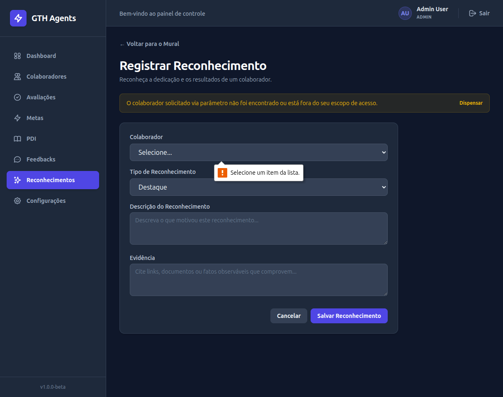
- **Observações**: N/A

---

### Cenário 7: Preservação do Formulário após Erro
- **Perfil**: LIDER, ADMIN ou RH
- **Pré-condições**: Simular indisponibilidade da API, interrupção do container ou falha de conexão.
- **IDs utilizados**: N/A
- **Passos**:
  1. Acessar `/reconhecimentos/novo`.
  2. Preencher todos os campos com dados válidos.
  3. Interromper o container da API ou desconectar a rede.
  4. Clicar em "Salvar".
- **Resultado esperado**: A página deve capturar o erro e exibir a mensagem em `submitError`, mas todos os dados digitados no formulário devem ser preservados no estado da tela.
- **Resultado observado**: Os dados digitados permaneceram no formulário, o erro foi exibido na tela.
- **Status**: APROVADO
- **Evidências**:
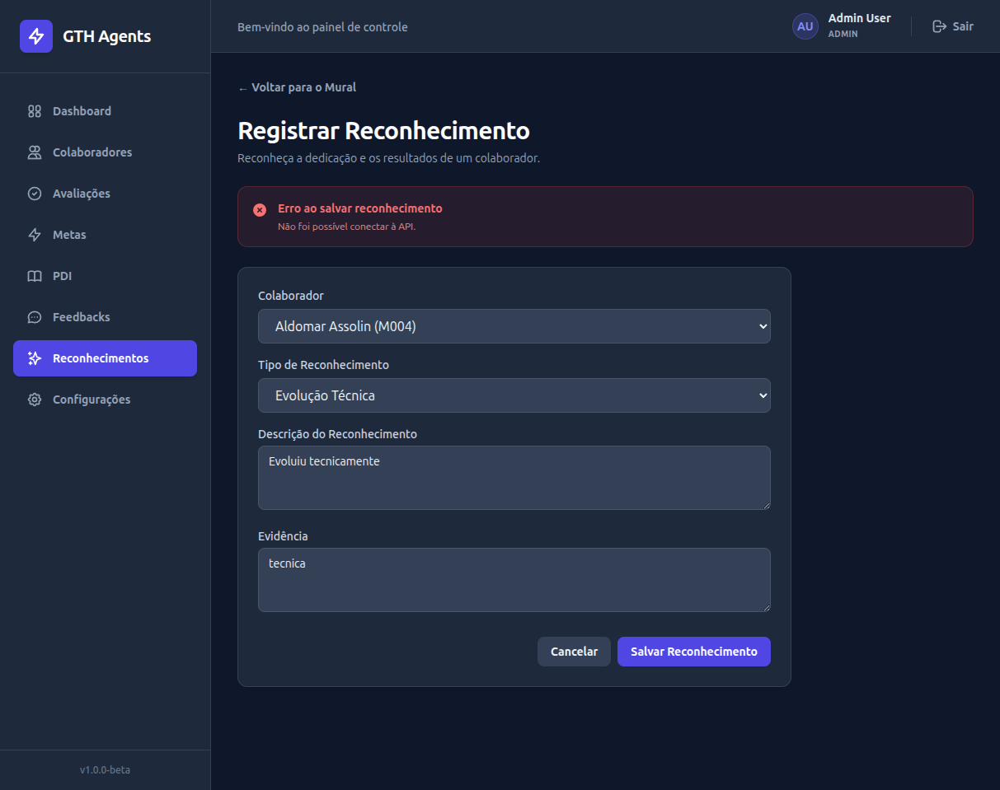
- **Observações**: N/A

---

### Cenário 8: Prevenção de Envio Duplicado
- **Perfil**: LIDER, ADMIN ou RH
- **Pré-condições**: Form preenchido com dados válidos.
- **IDs utilizados**: N/A
- **Passos**:
  1. Acessar `/reconhecimentos/novo` e preencher os dados.
  2. Clicar rapidamente duas vezes no botão de salvar.
- **Resultado esperado**: O botão de envio deve ser desabilitado instantaneamente após o primeiro clique (`isSubmitting === true`), impedindo requisições repetidas.
- **Resultado observado**: Ao clicar rapidamente duas vezes no botão, após o primeiro clique, é observada a desabilitação do botão, evitando assim o envio do formulário duplicado.
- **Status**: APROVADO
- **Evidências**: N/A
- **Observações**: N/A

---

### Cenário 9: Cancelamento com Motivo
- **Perfil**: LIDER, ADMIN ou RH
- **Pré-condições**: Existência de reconhecimento ativo (`ativo = true`).
- **IDs utilizados**: ID de um reconhecimento ativo.
- **Passos**:
  1. Localizar o card ativo no mural.
  2. Clicar em "Cancelar Reconhecimento".
  3. Preencher o motivo do cancelamento no modal.
  4. Confirmar a operação no modal.
- **Resultado esperado**: O reconhecimento é cancelado com sucesso. O card deve atualizar o badge de status para "Cancelado" e exibir a auditoria de cancelamento diferenciando os agentes: "Cancelado por você" (caso o usuário autenticado tenha cancelado) e o motivo preenchido.
- **Resultado observado**: O reconhecimento é cancelado com sucesso ao clicar em "Cancelar" no card de reconhecimentos. O badge de status é atualizado para "Cancelado" e o motivo preenchido é exibido. A auditoria de cancelamento diferencia o agente que cancelou o reconhecimento.
- **Status**: APROVADO
- **Evidências**:

- **Observações**: N/A

---

### Cenário 10: Motivo Vazio no Cancelamento
- **Perfil**: LIDER, ADMIN ou RH
- **Pré-condições**: Reconhecimento ativo disponível para cancelamento.
- **IDs utilizados**: ID de um reconhecimento ativo.
- **Passos**:
  1. Abrir o modal de cancelamento do reconhecimento.
  2. Deixar o campo de motivo em branco.
  3. Clicar no botão para confirmar.
- **Resultado esperado**: A validação local do modal impede o envio e exibe um erro amigável na tela.
- **Resultado observado**: A validação local do modal impede o envio e exibe um erro amigável na tela.
- **Status**: APROVADO
- **Evidências**:
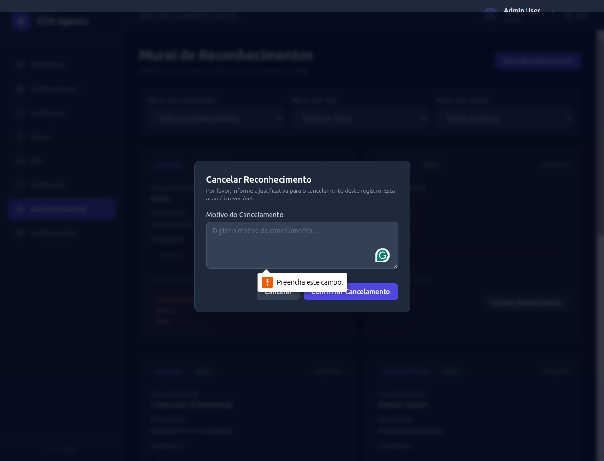
- **Observações**: N/A

---

### Cenário 11: Erro de Cancelamento (Falha de Conexão)
- **Perfil**: LIDER, ADMIN ou RH
- **Pré-condições**: Simular indisponibilidade da API, interrupção do container ou falha de conexão.
- **IDs utilizados**: ID de um reconhecimento ativo.
- **Passos**:
  1. Abrir o modal de cancelamento.
  2. Inserir o motivo.
  3. Indisponibilizar a API.
  4. Confirmar a operação de cancelamento.
- **Resultado esperado**: A interface exibe a mensagem de `cancelError` no topo da listagem, mas o mural de reconhecimentos e os cards carregados continuam intactos e visíveis.
- **Resultado observado**: Com a API indisponível, o modal permaneceu aberto, o motivo digitado foi preservado e a mensagem “Não foi possível conectar à API” foi exibida. O mural e os cards permaneceram visíveis, e o botão de confirmação foi reabilitado para nova tentativa. Após fechar o modal e abrir o cancelamento de outro reconhecimento, os estados de motivo e erro foram reinicializados.
- **Status**: APROVADO
- **Evidências**:
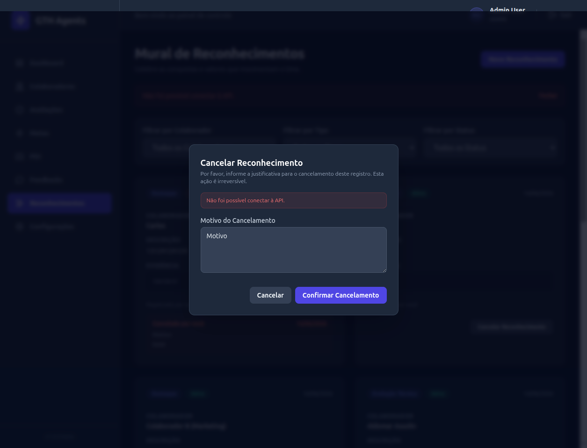
- **Observações**: O erro de conexão não desmonta a listagem e o estado temporário do modal é limpo ao encerrá-lo.

---

### Cenário 12: Erro de Cancelamento (Recurso Inexistente)
- **Perfil**: LIDER, ADMIN ou RH (via chamada direta de API por cliente HTTP ou Curl)
- **Pré-condições**: N/A (Valida apenas resposta, status e regras do backend)
- **IDs utilizados**: ID de reconhecimento inexistente (ex: `99999`).
- **Passos**:
  1. Disparar uma requisição PATCH direta para `/reconhecimentos/99999/cancelar` com `motivo_cancelamento` preenchido.
- **Resultado esperado**: O backend retorna erro de recurso não encontrado (HTTP 404 Not Found) e a requisição falha.
- **Resultado observado**: A API retornou HTTP 404 Not Found ao tentar cancelar o reconhecimento inexistente de ID 99999.
- **Status**: APROVADO
- **Evidências**: Captura da resposta no Postman.
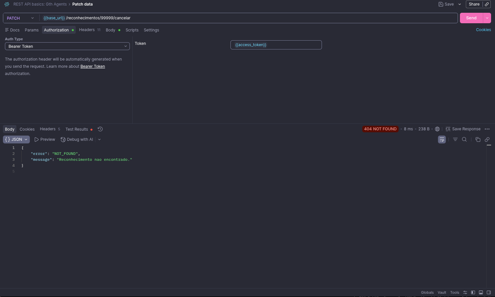
- **Observações**: O backend rejeitou corretamente a operação sobre recurso inexistente.

---

### Cenário 13: Cancelamento Duplicado (Proteção Visual)
- **Perfil**: LIDER, ADMIN ou RH
- **Pré-condições**: Exibição de um reconhecimento cancelado (`ativo = false`).
- **IDs utilizados**: ID de um reconhecimento cancelado.
- **Passos**:
  1. Visualizar o card correspondente ao reconhecimento cancelado no mural.
- **Resultado esperado**: O botão "Cancelar Reconhecimento" deve estar completamente oculto no card, impossibilitando um duplo cancelamento visual.
- **Resultado observado**: O reconhecimento cancelado foi exibido com o status “Cancelado” e sem o botão “Cancelar Reconhecimento”.
- **Status**: APROVADO
- **Evidências**: Captura de tela do card cancelado.
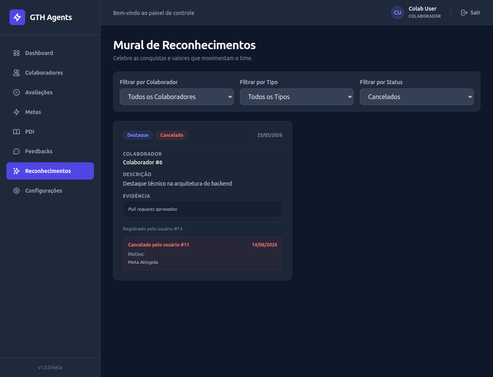
- **Observações**: A interface impede visualmente novo cancelamento.

---

### Cenário 14: Cancelamento Duplicado (Regra Backend)
- **Perfil**: LIDER, ADMIN ou RH (via chamada direta de API por cliente HTTP ou Curl)
- **Pré-condições**: Reconhecimento já cancelado. (Valida apenas resposta, status e regras do backend)
- **IDs utilizados**: ID de um reconhecimento com status cancelado.
- **Passos**:
  1. Disparar uma chamada PATCH direta para `/reconhecimentos/<ID_CANCELADO>/cancelar` com motivo preenchido.
- **Resultado esperado**: O backend deve rejeitar a requisição retornando erro de validação (HTTP 400 Bad Request) porque o reconhecimento já está inativo.
- **Resultado observado**: A API retornou HTTP 400 Bad Request e informou que o reconhecimento já estava cancelado.
- **Status**: APROVADO
- **Evidências**: Captura da resposta no Postman.
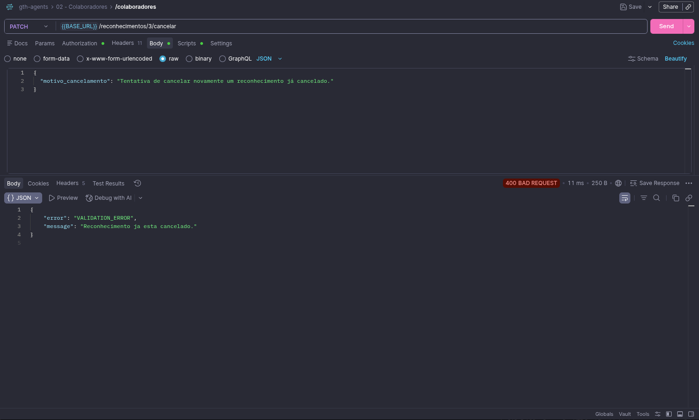
- **Observações**: A regra do backend bloqueou corretamente o cancelamento duplicado.

---

### Cenário 15: Estado Vazio (Contextual)
- **Perfil**: Todos os perfis autorizados
- **Pré-condições**: O colaborador selecionado não possui reconhecimentos.
- **IDs utilizados**: ID de colaborador sem reconhecimentos.
- **Passos**:
  1. Navegar para `/colaboradores/:id/reconhecimentos`.
- **Resultado esperado**: A tela deve renderizar com sucesso o componente `<EmptyState />` indicando que não existem reconhecimentos registrados para este colaborador.
- **Resultado observado**: A tela renderiza o componente EmptyState.
- **Status**: APROVADO
- **Evidências**:
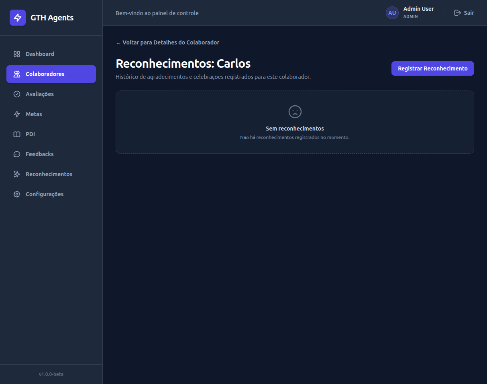
- **Observações**: N/A

---

### Cenário 16: Estado Vazio (Global)
- **Perfil**: LIDER, ADMIN ou RH
- **Pré-condições**: Usuário logado sem qualquer acesso a registros, ou ambiente de testes limpo.
- **IDs utilizados**: N/A
- **Passos**:
  1. Acessar `/reconhecimentos`.
- **Resultado esperado**: A listagem global deve exibir o componente `<EmptyState />` informando que nenhum registro foi encontrado. Se o banco possuir dados fixos inviabilizando o teste do vazio global sem exclusão física, registrar o cenário como `BLOQUEADO`.
- **Resultado observado**: A listagem global exibe o componente `EmptyState`.
- **Status**: APROVADO
- **Evidências**:
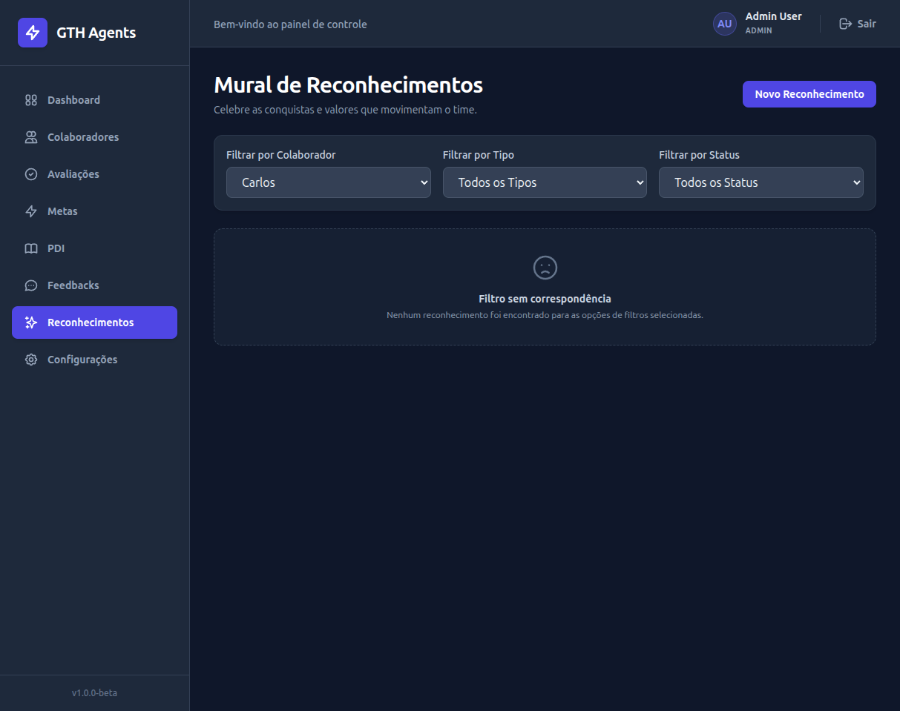
- **Observações**: N/A

---

### Cenário 17: Estado Vazio (Filtro Sem Correspondência)
- **Perfil**: LIDER, ADMIN ou RH
- **Pré-condições**: N/A
- **IDs utilizados**: N/A
- **Passos**:
  1. Acessar `/reconhecimentos`.
  2. Aplicar um filtro de texto (ou colaborador) que garanta zero correspondências nos cards atuais.
- **Resultado esperado**: A interface do mural deve exibir um feedback claro informando que não há registros correspondentes aos filtros selecionados, distinguindo-se do vazio real do banco de dados (o cabeçalho e os seletores de filtros devem continuar visíveis).
- **Resultado observado**: A interface do mural exibe o componente `EmptyState`, e continua com os filtros visíveis.
- **Status**: APROVADO
- **Evidências**:
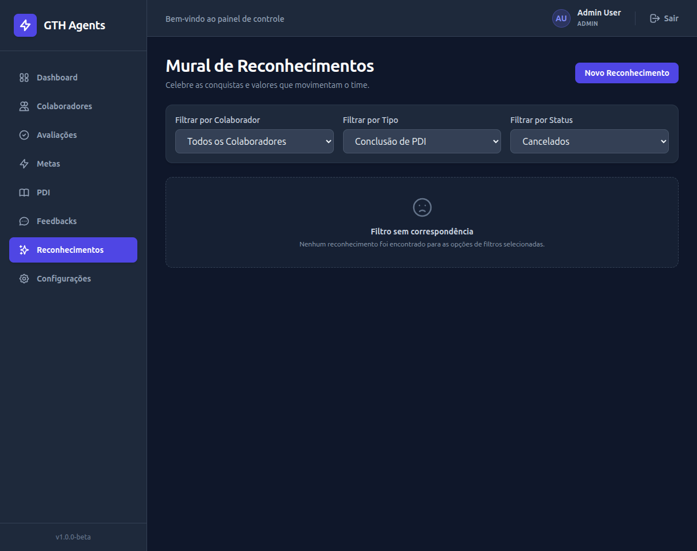
- **Observações**: N/A

---

### Cenário 18: Proteção Visual da Rota (Acesso de Colaborador)
- **Perfil**: COLABORADOR
- **Pré-condições**: Usuário logado possui perfil de colaborador.
- **IDs utilizados**: N/A
- **Passos**:
  1. Navegar para a página `/reconhecimentos`.
  2. Verificar as ações visíveis.
- **Resultado esperado**: O botão "Novo Reconhecimento" e a ação de cancelar nos cards devem estar ocultados.
- **Resultado observado**: O botão "Novo Reconhecimento" e a ação de cancelar nos cards estão ocultos.
- **Status**: APROVADO
- **Evidências**:
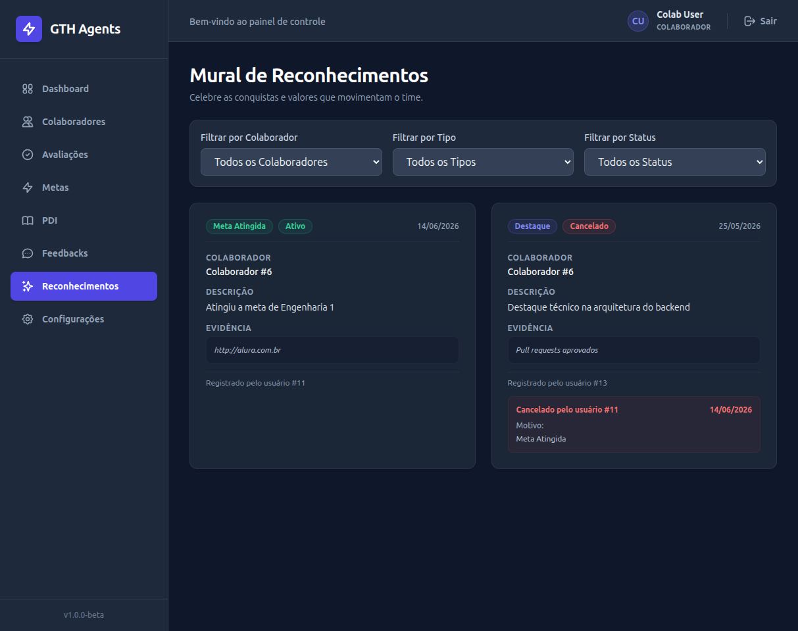
- **Observações**: N/A

---

### Cenário 19: Resposta HTTP 403 do Backend (Rejeição de Perfil)
- **Perfil**: COLABORADOR (via chamada direta de API por cliente HTTP ou Curl)
- **Pré-condições**: Utilização do token do colaborador. (Valida apenas resposta, status e regras do backend)
- **IDs utilizados**: N/A
- **Passos**:
  1. Enviar uma requisição POST diretamente para `/reconhecimentos` contendo payload preenchido com credenciais/token de perfil `COLABORADOR`.
- **Resultado esperado**: O backend deve rejeitar a requisição retornando HTTP 403 Forbidden.
- **Resultado observado**: O backend rejeita a chamada com uma requisição 403 Forbidden.
- **Status**: APROVADO
- **Evidências**:
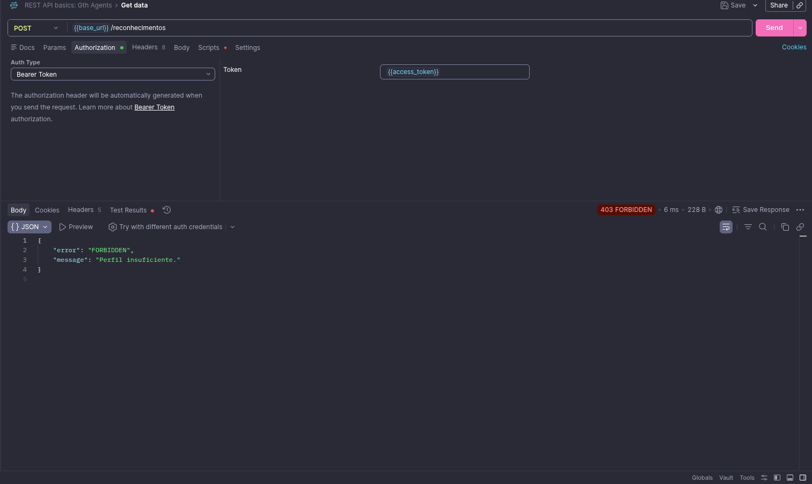
- **Observações**: N/A

---

### Cenário 20: Tratamento de Erro de Submissão na Interface
- **Perfil**: LIDER, ADMIN ou RH
- **Pré-condições**: Simular uma falha lógica do backend ou retorno de erro 400.
- **IDs utilizados**: N/A
- **Passos**:
  1. Acessar a página de novo reconhecimento.
  2. Enviar um payload que force a rejeição lógica do backend (ex: com dados que a API declare inválidos).
- **Resultado esperado**: A página captura o erro HTTP de validação, traduz e o exibe no banner `submitError` sem crashar a tela.
- **Resultado observado**: N/A
- **Status**: BLOQUEADO
- **Evidências**: N/A
- **Observações**: Não foi identificada regra de validação acessível pela interface capaz de produzir HTTP 400 sem alteração temporária do código ou dos dados.

---

### Cenário 21: Acesso Direto e Reload
- **Perfil**: COLABORADOR
- **Pré-condições**: N/A
- **IDs utilizados**: N/A
- **Passos**:
  1. Colar diretamente a URL `/reconhecimentos/novo` no navegador logado como `COLABORADOR`.
  2. Testar o reload da página (`F5`).
- **Resultado esperado**: A página deve exibir "Acesso Negado", impedir o carregamento da lista de colaboradores, não renderizar o formulário e não efetuar nenhuma requisição de criação. O reload da página deve manter essa proteção ativa.
- **Resultado observado**: com a URL `/reconhecimentos/novo` a página exibe a mensagem "Acesso Negado".
- **Status**: APROVADO
- **Evidências**:

- **Observações**:

---

### Cenário 22: Colaborador Inexistente na Rota Contextual
- **Perfil**: ADMIN ou RH
- **Pré-condições**: ID de colaborador inexistente no banco.
- **IDs utilizados**: ID inexistente (ex: `99999`).
- **Passos**:
  1. Acessar diretamente a URL `/colaboradores/99999/reconhecimentos`.
- **Resultado esperado**: A página contextual deve tratar amigavelmente o colaborador não encontrado exibindo um componente `<ErrorMessage />` apropriado.
- **Resultado observado**: Utilizando a url `/colaboradores/99999/reconhecimentos` a página exibe uma mensagem de erro. com um botão de `tentar novamente`
- **Status**: APROVADO
- **Evidências**:
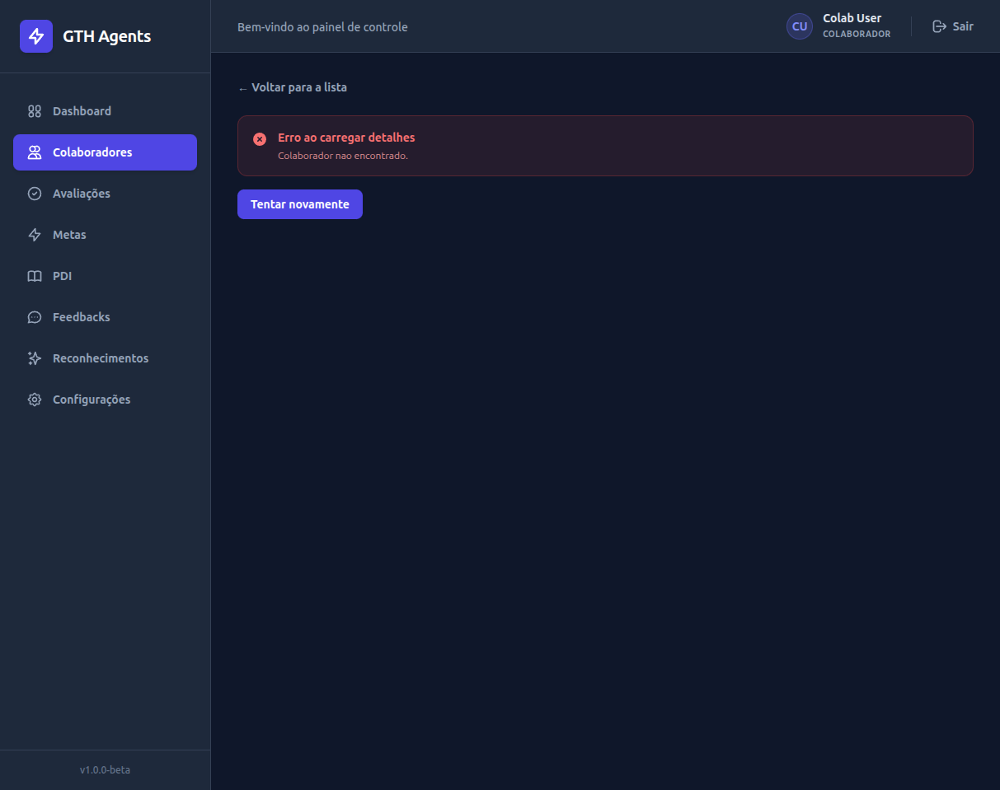
- **Observações**: N/A

---

Status: VALIDAÇÃO HUMANA CONCLUÍDA
