# Scratchpad de Validação Manual - Módulo de Feedbacks (Issue #041)

Este documento descreve os cenários de testes e validações que o homologador humano deve executar no navegador após a implementação técnica.

**Status atual da validação:** `AGUARDANDO VALIDAÇÃO HUMANA`

---

## Cenários de Teste Manual

### 1. Acesso à página central `/feedbacks` sem colaborador selecionado
- **Passos**:
  1. Efetue login como `ADMIN`, `RH` ou `LIDER`.
  2. Acesse `/feedbacks` via Sidebar.
- **Resultado esperado**:
  - A página é carregada corretamente.
  - Exibe um estado inicial orientando o usuário a selecionar um colaborador (exemplo: "Selecione um colaborador para visualizar os feedbacks registrados").
  - Nenhuma requisição de feedbacks é feita antes da seleção.
  - Há uma indicação em texto informando que não existe uma listagem global no backend.

  **Resultado observado:**
  A página carrega corretamente, exibe um estado inicial orientando o usuário a selecionar um colaborador e nenhuma requisição de feedbacks é feita antes da seleção.

  **Evidência:**
  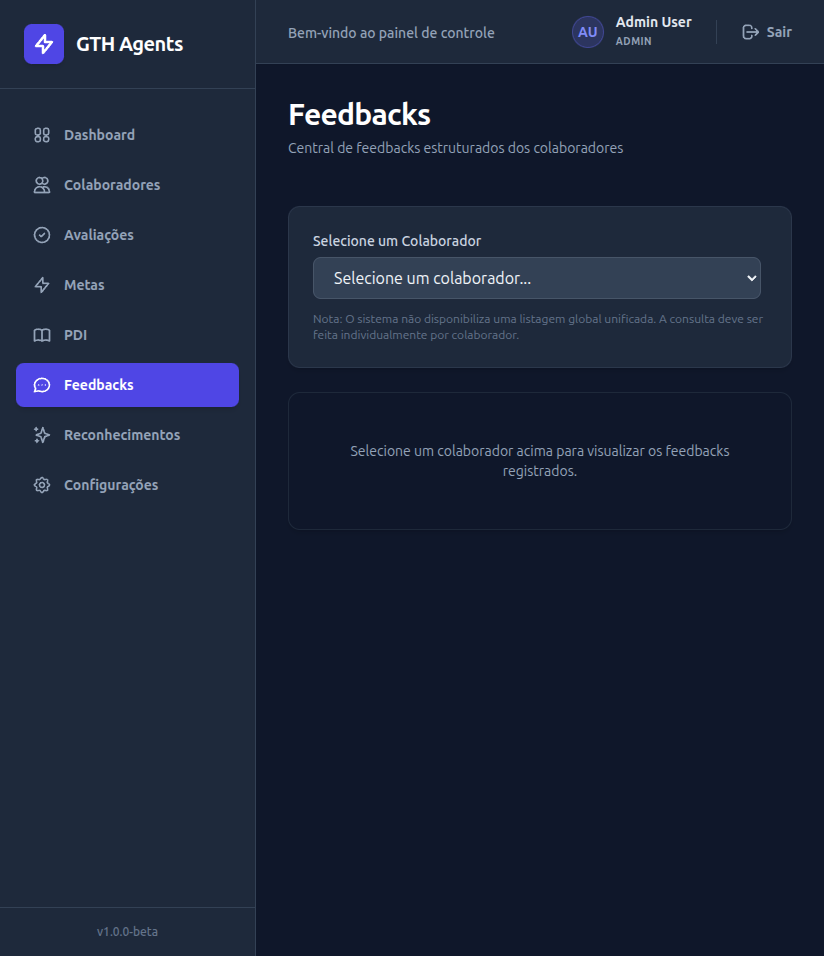

### 2. Seleção de colaborador na página central `/feedbacks` (Com feedbacks)
- **Passos**:
  1. No seletor, escolha um colaborador válido que já possua feedbacks registrados (ex: "Colaborador A" se usar os dados de seed).
- **Resultado esperado**:
  - O sistema busca e exibe a lista dos feedbacks do colaborador selecionado.
  - Exibe o aviso de que são mostrados apenas os feedbacks mais recentes (limite de 5 no backend).
  - É possível limpar ou trocar de colaborador no seletor, retornando ao estado inicial ou buscando novos dados.

  **Resultado observado:**
  O sistema busca e exibe a lista dos feedbacks do colaborador selecionado.

  **Evidência:**
  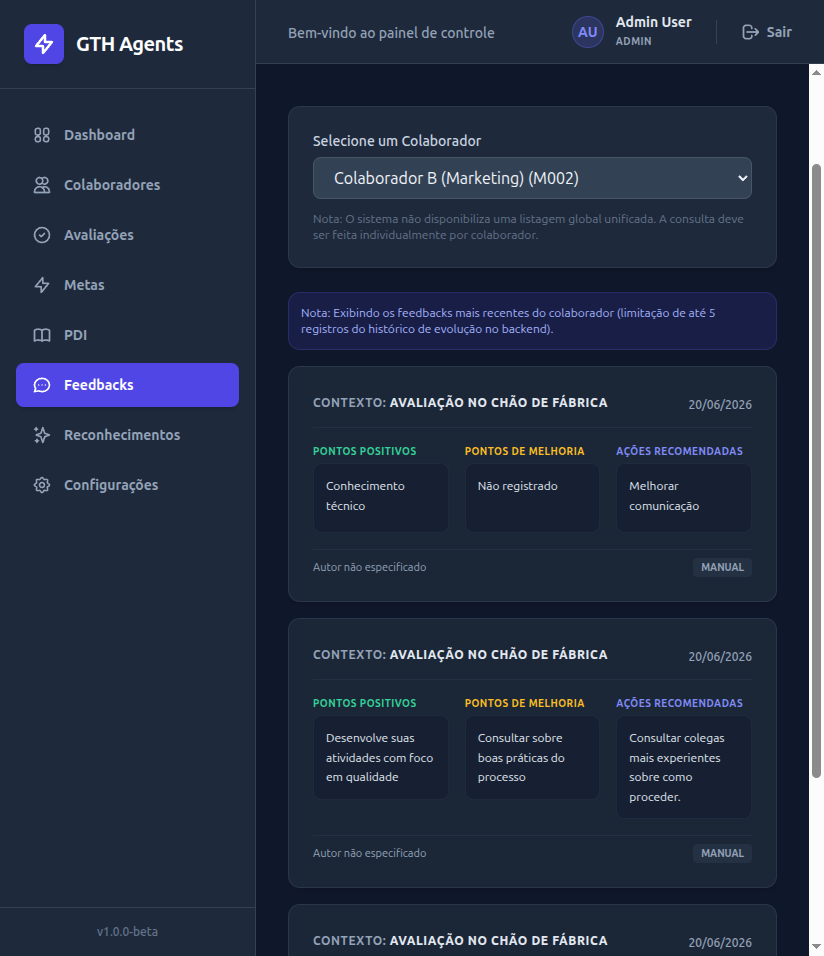

### 3. Seleção de colaborador na página central `/feedbacks` (Sem feedbacks)
- **Passos**:
  1. No seletor, escolha um colaborador válido que não possua feedbacks (ex: "Colaborador B").
- **Resultado esperado**:
  - Exibe o estado vazio amigável: "Nenhum feedback registrado para este colaborador."
  - Não deve ocorrer tela branca ou erro no console.

  **Resultado observado:**
  O sistema exibe o estado vazio amigável: "Nenhum feedback registrado para este colaborador."

  **Evidência:**
  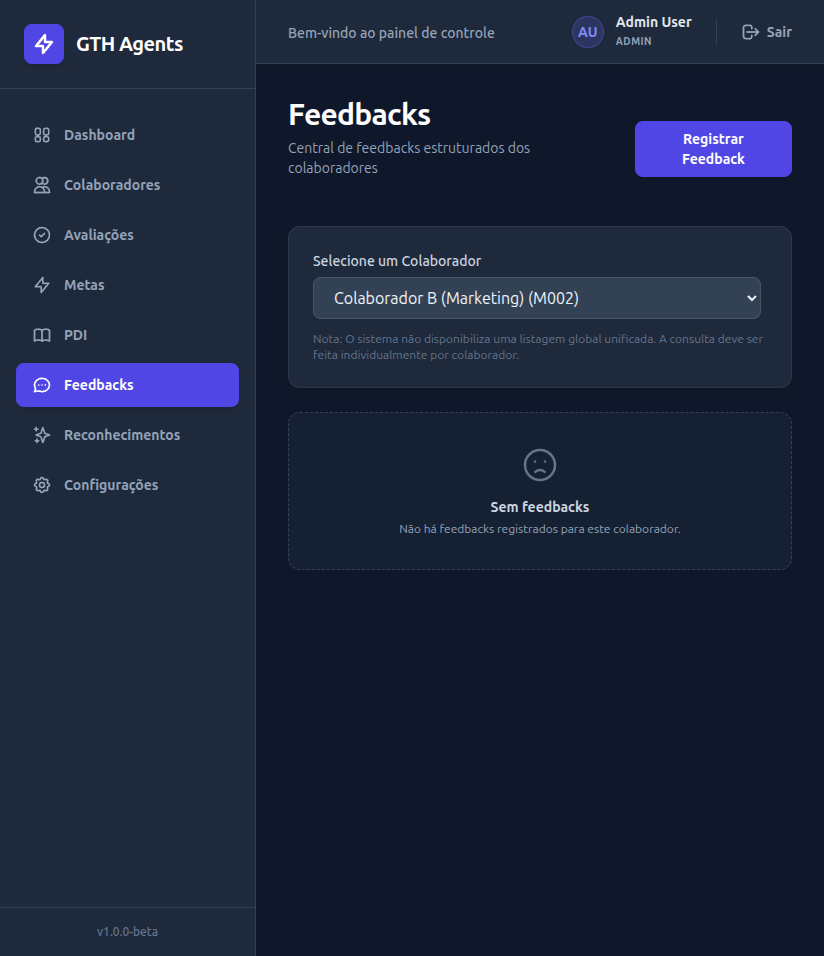

### 4. Acessar `/feedbacks/novo` sem query parameter (Criação válida)
- **Passos**:
  1. Acesse `/feedbacks/novo` com usuário autorizado.
  2. Preencha todos os campos corretamente (selecione um colaborador, digite contexto opcional, ponto positivo, ponto de melhoria opcional, ação recomendada).
  3. Clique em "Salvar Feedback".
- **Resultado esperado**:
  - Exibe mensagem de sucesso amigável.
  - Redireciona automaticamente para `/colaboradores/{id}/feedbacks`.
  - O feedback criado aparece na listagem como o mais recente.

  **Resultado observado:**
  O sistema exibe mensagem de sucesso amigável e redireciona automaticamente para `/colaboradores/{id}/feedbacks`.

  **Evidência:**
  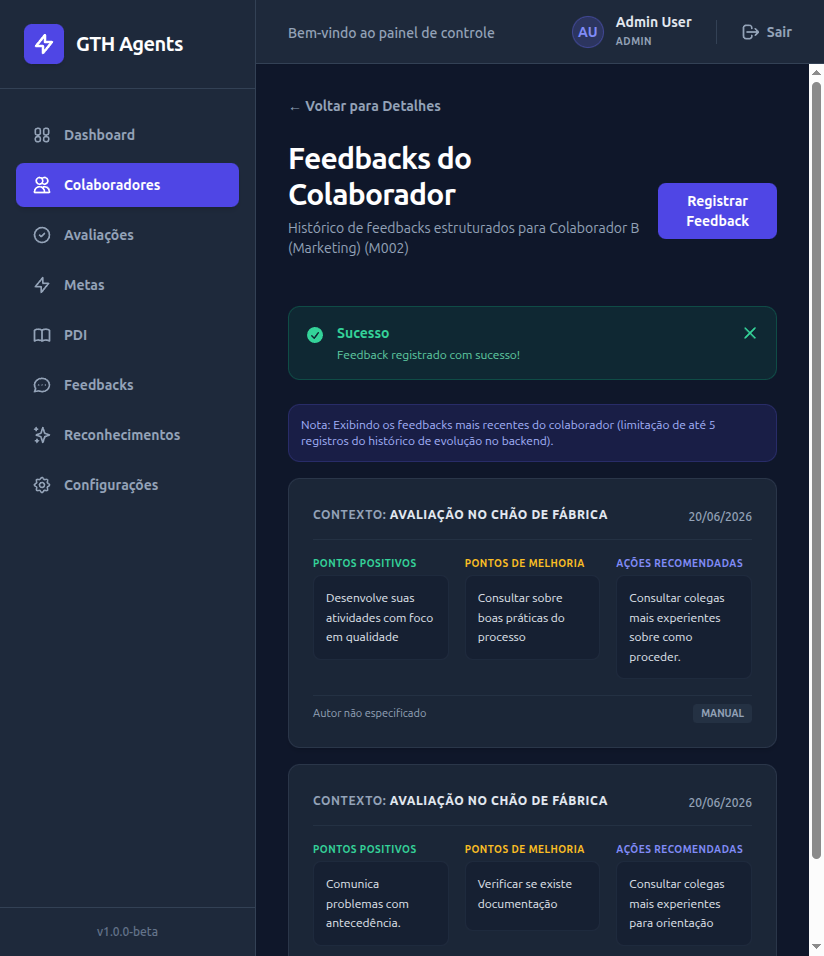

### 5. Validação de campos obrigatórios
- **Passos**:
  1. Vá em `/feedbacks/novo`.
  2. Deixe "Colaborador", "Ponto Positivo" ou "Ação Recomendada" vazios e tente enviar.
- **Resultado esperado**:
  - O sistema impede o envio e exibe um erro informando qual campo obrigatório está faltando.

  **Resultado observado:**
  O sistema impede o envio e exibe um erro informando qual campo obrigatório está faltando.

  **Evidência:**
  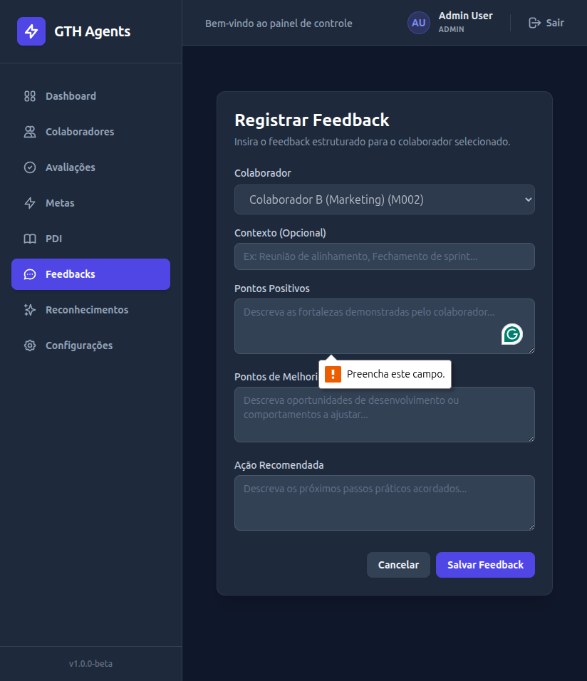

### 6. Simular erro de conexão no POST (erro de submissão)
- **Passos**:
  1. Vá em `/feedbacks/novo`, preencha os dados.
  2. Interrompa a API ou desligue a rede e tente submeter.
- **Resultado esperado**:
  - Exibe o erro de envio (`submitError`) no topo do formulário.
  - O formulário **não** é desmontado e os dados preenchidos **são preservados** na tela.
  - O botão de salvar é reabilitado para nova tentativa.

  **Resultado observado:**
  O sistema exibe o erro de envio (`submitError`) no topo do formulário.

  **Evidência:**
  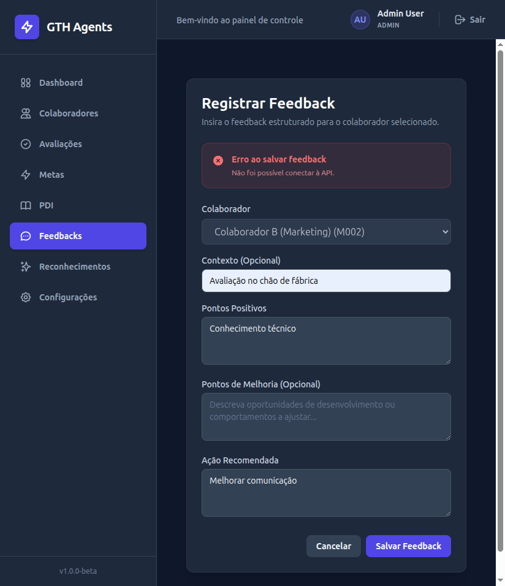

### 7. Acessar `/feedbacks/novo` com Query String Válida
- **Passos**:
  1. Acesse `/feedbacks/novo?colaborador_id=1` (ID existente).
- **Resultado esperado**:
  - O colaborador correspondente está pré-selecionado.
  - O seletor de colaboradores está desativado (bloqueado/lock), impedindo troca.

  **Resultado observado:**
  O sistema exibe o seletor de colaboradores desativado (bloqueado/lock), impedindo troca.

  **Evidência:**
  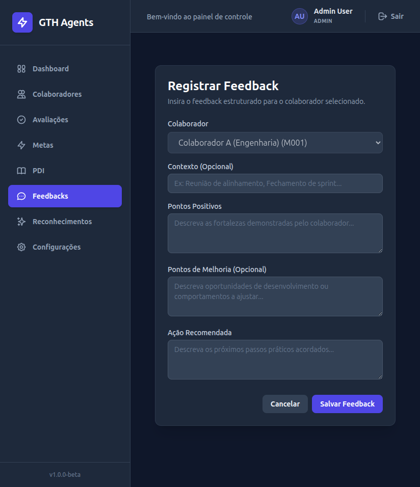

### 8. Acessar `/feedbacks/novo` com Query String Inválida
- **Passos**:
  1. Acesse `/feedbacks/novo?colaborador_id=99999` (ID inexistente) ou `/feedbacks/novo?colaborador_id=abc` (valor inválido).
- **Resultado esperado**:
  - O seletor de colaborador não trava em nenhuma opção inválida e permanece ativo para que o usuário escolha um colaborador válido da lista.

  **Resultado observado:**
  O sistema exibe o seletor de colaboradores desativado (bloqueado/lock), impedindo troca.

  **Evidência:**
  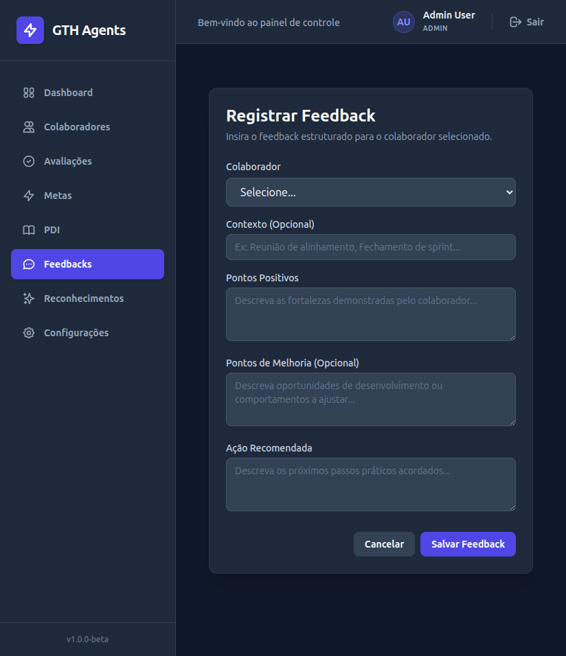

### 9. Acessar `/colaboradores/99999/feedbacks` (Colaborador Inexistente)
- **Passos**:
  1. Acesse diretamente `/colaboradores/99999/feedbacks`.
- **Resultado esperado**:
  - O sistema exibe um erro de carregamento amigável (`loadError`), bloqueando a tela de forma segura (404 Not Found).

  **Resultado observado:**
  O sistema exibe o erro de carregamento amigável (`loadError`), bloqueando a tela de forma segura (404 Not Found).

  **Evidência:**
  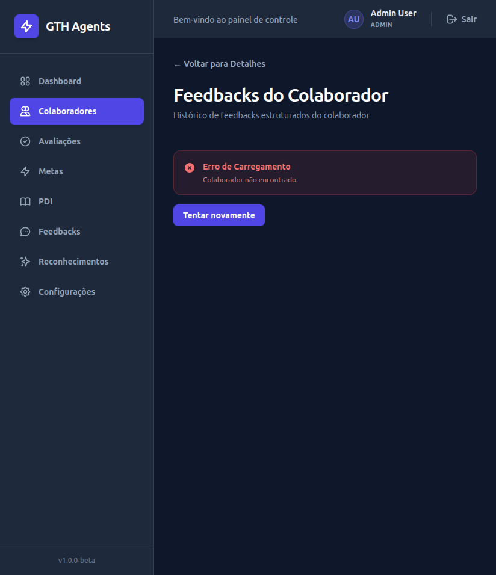

### 10. Bloqueio visual para COLABORADOR
- **Passos**:
  1. Faça login como `COLABORADOR`.
  2. Tente acessar diretamente `/feedbacks/novo` ou acessar `/feedbacks` e validar se botões de criar novos feedbacks estão ocultados.
- **Resultado esperado**:
  - Ao acessar `/feedbacks/novo` diretamente, exibe tela de "Acesso Negado".
  - Na listagem `/feedbacks` e no perfil do colaborador, botões e links de registro de feedback não devem estar visíveis.

  **Resultado observado:**
  O sistema exibe tela de "Acesso Negado".

  **Evidência:**
  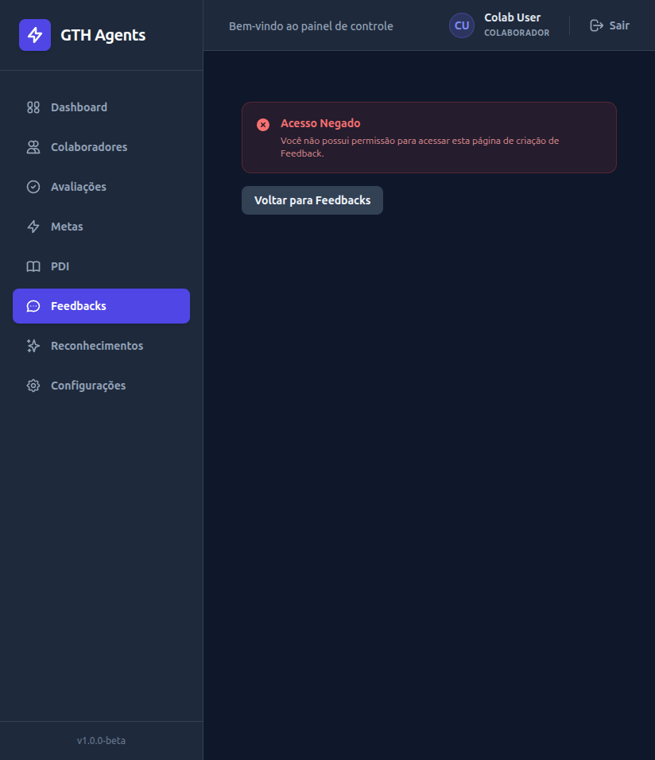

### 11. Aviso visual da limitação de até 5 feedbacks recentes
- **Passos**:
  1. Acesse a lista de feedbacks de qualquer colaborador.
- **Resultado esperado**:
  - Confirmar a presença de uma mensagem ou nota explicativa como "Exibindo os feedbacks mais recentes do colaborador (limitação de até 5 registros)."

  **Resultado observado:**
  O sistema exibe o aviso visual da limitação de até 5 feedbacks recentes.

  **Evidência:**
  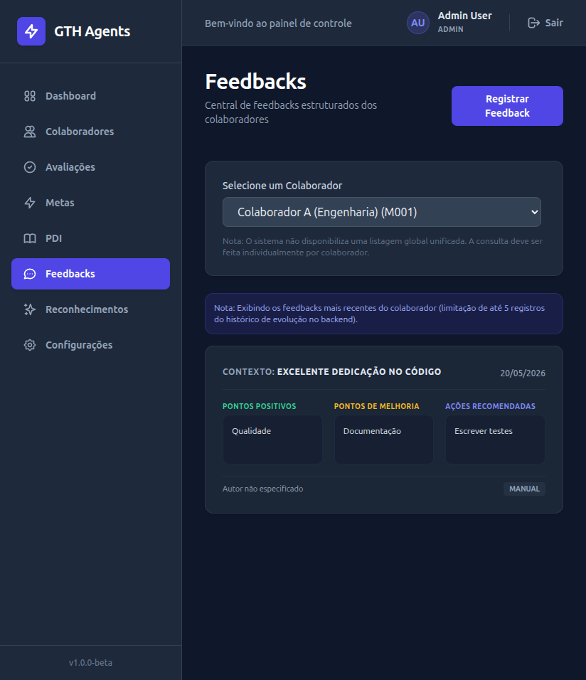

### 12. Reload e Responsividade
- **Passos**:
  1. Efetue reload (F5) na página `/feedbacks` com um colaborador selecionado.
  2. Ajuste o tamanho da tela para o modo mobile.
- **Resultado esperado**:
  - A página mantém o comportamento consistente.
  - O layout do formulário e dos cards se adapta corretamente sem quebras visuais em telas menores.

  **Resultado observado:**
  A página mantém o comportamento consistente.

  **Evidência:**
  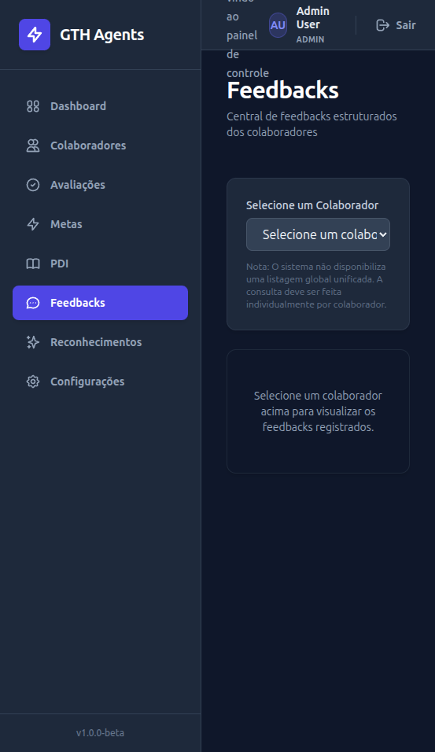

---

## Validações Técnicas (Antigravity)

- [X] Execução de Lint (`npm run lint` na pasta `frontend`)
- [X] Execução de Build (`npm run build` na pasta `frontend`)
- [X] Docker Compose Config (`docker compose config` na raiz)
- [X] Git Diff Check (`git diff --check` na raiz)
