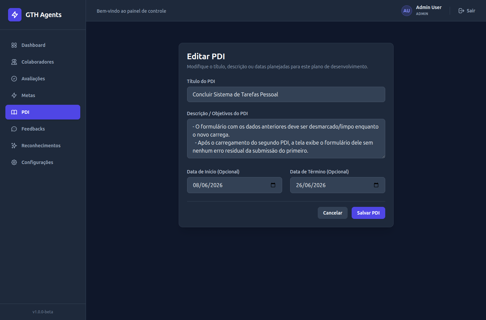

# Scratchpad de Validação Manual - ISSUE #068

## Identificação

- **Issue**: #068
- **Módulo**: Correção de Estados de Erro nos Formulários
- **Branch**: main (local)
- **Data**: 2026-06-13
- **Responsável pela validação**: Usuário
- **Status**: AGUARDANDO VALIDAÇÃO HUMANA

---

## Validações técnicas já executadas pelo Antigravity

| Validação | Resultado | Evidência |
|---|---|---|
| Lint | Aprovado | Comando `npm run lint` executado com sucesso no frontend (sem erros). |
| Build | Aprovado | Comando `npm run build` executado com sucesso, gerando bundles de produção sem falhas. |
| Testes automatizados | Não existentes | Nenhum teste unitário ou de integração automatizado disponível no frontend. |
| Git Formatação | Aprovado | Comando `git diff --check` executado com sucesso (sem problemas de formatação). |

---

## Ambiente necessário

- **Frontend**: Servidor Vite rodando em `http://localhost:5173`.
- **API**: Servidor Flask rodando em `http://localhost:5000`.
- **Banco**: PostgreSQL rodando em container.
- **Perfis necessários**:
  - Um usuário com perfil de gestor (`LIDER`, `RH` ou `ADMIN`).
- **Dados de teste necessários**:
  - Um colaborador cadastrado para vincular a Meta ou PDI.

---

## Dados gerados durante o teste

O validador humano deve preencher esta tabela com os IDs gerados/utilizados durante a execução dos testes:

| Recurso | Identificador |
|---|---|
| colaborador_id | 6|
| pdi_principal_id | 9|
| meta_principal_id | 6|

---

## Cenários manuais (Navegador)

### Cenário 1 - Comportamento sob Erro de Conexão na Criação de Meta
- **Tipo**: `MANUAL_FUNCIONAL` | `MANUAL_VISUAL`
- **Objetivo**: Verificar se, ao tentar salvar uma meta sem backend ativo, a página exibe o erro de rede de forma isolada, mantém o formulário montado e preserva todos os dados preenchidos.
- **Pré-condições**: Usuário logado como gestor.
- **Passos**:
  1. Acessar `/metas/novo`.
  2. Preencher todos os campos da meta (colaborador, título, descrição, prazo, prioridade).
  3. No terminal da máquina hospedeira, parar o backend/API (ou simular queda desconectando a internet/porta).
  4. Clicar no botão "Criar Meta".
- **Resultado esperado**: 
  - O formulário continua renderizado na tela.
  - Todos os dados inseridos nos campos são mantidos sem alteração ou perda.
  - Um alerta vermelho (`ErrorMessage`) surge no topo do formulário exibindo "Não foi possível conectar à API." ou equivalente.
  - O botão de envio é reabilitado (não fica travado em estado de carregamento/salvamento).
- **Resultado observado**: Com a submissão do formulário sem o backend ativo ocorre o reload da página com a mensagem de erro no topo do formulário e os dados preenchidos não são perdidos. O botão de envio retorna ao estado normal (não fica travado em estado de carregamento/salvamento). 
- **Status HTTP observado**: N/A
- **Resultado**: `APROVADO`
- **Evidências**:
  - Screenshot sugerido: `issue_068_meta_erro_conexao.png`

---

### Cenário 2 - Comportamento sob Erro de Conexão na Criação de PDI
- **Tipo**: `MANUAL_FUNCIONAL` | `MANUAL_VISUAL`
- **Objetivo**: Validar se a página de criação de PDI mantém o formulário aberto, os campos preenchidos e o botão ativo sob erro de conexão durante a submissão.
- **Pré-condições**: Logado como gestor. Backend inativo.
- **Passos**:
  1. Acessar `/pdis/novo`.
  2. Selecionar o colaborador, preencher título, descrição, datas e adicionar uma ação de desenvolvimento inicial.
  3. Clicar no botão "Criar PDI".
- **Resultado esperado**:
  - A tela não muda para o estado de erro completo; o formulário permanece exibido com todos os dados.
  - Alerta de erro de conexão renderizado no topo do card do formulário.
  - Botão de submissão volta a ficar ativo para novas tentativas.
- **Resultado observado**: A tela não muda para o estado de erro completo; o formulário permanece exibido com todos os dados. Ocorre reload da página com a mensagem de erro no topo do formulário e os dados preenchidos não são perdidos. O botão de envio retorna ao estado normal (não fica travado em estado de carregamento/salvamento). 
- **Status HTTP observado**: N/A
- **Resultado**: `APROVADO`
- **Evidências**:
  - Screenshot sugerido: `issue_068_novo_pdi_erro_conexao.png`

---

### Cenário 3 - Comportamento sob Erro de Conexão na Edição de PDI
- **Tipo**: `MANUAL_FUNCIONAL`
- **Objetivo**: Garantir que a tela de edição de PDI não desmonte os campos de edição caso ocorra falha de conexão no salvamento.
- **Pré-condições**: Logado como gestor. PDI ativo previamente cadastrado. Backend inativo.
- **Passos**:
  1. Acessar a tela de detalhes de um PDI ativo (`/pdis/{id}`).
  2. Clicar em "Editar PDI". (Nota: Se o backend estiver desligado neste momento, o carregamento inicial falhará exibindo a tela cheia de `loadError`, o que é o comportamento correto).
  3. Se a tela de edição já estiver montada com o backend ativo, desligue o backend agora.
  4. Altere o título ou descrição do PDI e clique em "Salvar Alterações".
- **Resultado esperado**:
  - O formulário não é desmontado; os inputs persistem preenchidos.
  - Alerta de erro de rede surge acima do formulário.
  - O botão de salvar é destravado.
- **Resultado observado**: O formulário não é desmontado; os inputs persistem preenchidos. Alerta de erro de rede surge acima do formulário. O botão de salvar é destravado. 
- **Status HTTP observado**: N/A
- **Resultado**: `APROVADO`
- **Evidências**:
  - Screenshot sugerido: `issue_068_editar_pdi_erro_conexao.png`

---

### Cenário 4 - Erro de Validação de Negócio (HTTP 400) na Criação de Meta
- **Tipo**: `MANUAL_FUNCIONAL`
- **Objetivo**: Testar se a tentativa de cadastro de meta com informações que violam regras de validação do backend exibe a mensagem de erro retornada pela API sem desmontar o formulário.
- **Pré-condições**: Backend ativo. Logado como gestor.
- **Como forçar o HTTP 400 do backend**:
  Como o backend aceita datas antigas e a validação de campos obrigatórios é barrada pelo frontend, para forçar a API a retornar um erro 400 real:
  1. No arquivo `frontend/src/features/metas/MetaForm.jsx`, comente temporariamente as linhas que validam o título no método `validate()` (ex: comente a verificação de `!form.titulo`).
  2. No formulário de criação de Meta (`/metas/novo`), deixe o campo **Título** vazio e preencha os demais.
  3. Clicar em "Criar Meta".
- **Passos**:
  1. Executar os passos acima para contornar o validador local.
  2. Clicar em "Criar Meta" com o título vazio.
- **Resultado esperado**:
  - O backend retorna HTTP 400 com a mensagem `"Titulo da meta e obrigatorio."`.
  - O formulário continua aberto e com as informações mantidas.
  - Exibe a mensagem de validação retornada pela API no topo.
  - O botão de salvar é destravado para permitir ajuste e reenvio rápido.
- **Resultado observado**: O backend retorna HTTP 400 com a mensagem `"Titulo da meta e obrigatorio."`.

>Ferramenta utilizada: Postman


- **Status HTTP observado**: 400
- **Resultado**: `APROVADO`
- **Evidências**:
  - Screenshot sugerido: `issue_068_meta_erro_validacao.png`

---

### Cenário 5 - Erro de Validação de Negócio (HTTP 400) na Criação/Edição de PDI
- **Tipo**: `MANUAL_FUNCIONAL`
- **Objetivo**: Testar se a tentativa de edição de PDI com conflito de concorrência ou status inválido exibe o erro da API sem desmontar o formulário.
- **Pré-condições**: Backend ativo. Logado como gestor.
- **Como forçar o HTTP 400 do backend (Concorrência de Status)**:
  Como o backend aceita datas em qualquer ordem, podemos simular um HTTP 400 real através da regra de negócio que impede alteração em PDI já concluído:
  1. Abra a tela de detalhes de um PDI ativo (`/pdis/{id}`) na **Aba 1** do navegador.
  2. Abra a tela de edição desse mesmo PDI (`/pdis/{id}/editar`) na **Aba 2** do navegador.
  3. Na **Aba 1**, clique em "Concluir PDI" (o status do PDI passa a ser `CONCLUIDO` no banco).
  4. Na **Aba 2** (que ainda exibe o formulário de edição aberto), altere a descrição e clique em "Salvar Alterações".
- **Passos**:
  1. Executar a simulação de concorrência descrita acima.
  2. Clicar em "Salvar Alterações" na página de edição aberta da Aba 2.
- **Resultado esperado**:
  - O backend retorna HTTP 400 com a mensagem `"PDI concluido nao pode ser alterado."`.
  - O formulário permanece exibido e com os dados editados intactos.
  - A mensagem de erro da API é exibida em alerta vermelho acima do formulário.
  - O botão de salvar é destravado.
- **Resultado observado**: O backend retornou :
```bash
api-1  | 172.19.0.1 - - [13/Jun/2026 23:10:43] "PATCH /pdis/9 HTTP/1.1" 400 -

```
corroborando com o esperado, também foi renderizado um alerta de erro vermelho em cima do formulário.


- **Status HTTP observado**: 400
- **Resultado**: `APROVADO`
- **Evidências**:
  - Screenshot sugerido: `issue_068_pdi_erro_validacao_datas.png`

---

### Cenário 6 - Limpeza do Estado de Erro na Submissão
- **Tipo**: `MANUAL_FUNCIONAL`
- **Objetivo**: Confirmar que o alerta de erro de submissão anterior (`submitError`) é limpo da tela imediatamente ao iniciar uma nova submissão do formulário.
- **Pré-condições**: Backend ativo.
- **Dica para evitar recarregamento automático do Vite (HMR)**:
  Ao iniciar ou desligar o backend, o servidor de desenvolvimento do Vite pode recarregar a página automaticamente se detectar perda/retorno da conexão com o proxy, o que aciona o carregamento inicial (`loadError`). Para testar apenas a limpeza de submissão:
  1. Com o backend inativo, preencha o formulário e clique em "Criar PDI" (exibindo o erro de conexão/salvamento no topo).
  2. Ligue o backend e aguarde alguns segundos até que ele esteja totalmente pronto.
  3. **Sem recarregar a página**, clique novamente no botão "Criar PDI".
- **Passos**:
  1. Executar o fluxo acima.
  2. Observar o alerta de erro no topo do formulário no exato instante do clique.
- **Resultado esperado**: 
  - Ao clicar pela segunda vez, o alerta de erro vermelho do envio anterior deve sumir imediatamente da tela enquanto o botão exibe o estado de "Salvando..." ou loading.
- **Resultado observado**: Ao clicar pela segunda vez, o alerta de erro vermelho do envio anterior desaparece, o botão exibe o estado de "Salvando...".


- **Resultado**: `APROVADO`

---

### Cenário 7 - Navegação entre Edições de PDIs Distintos sem Reload
- **Tipo**: `MANUAL_FUNCIONAL`
- **Objetivo**: Garantir que a navegação direta entre as páginas de edição de dois PDIs distintos sem reload limpe os erros de submissão e o formulário anterior.
- **Pré-condições**: Dois PDIs ativos e editáveis cadastrados no banco (ex: ID 9 e ID 10).
- **Passos**:
  1. Acessar a página de edição do primeiro PDI (ex: `/pdis/9/editar`).
  2. Com o backend desligado, tentar submeter o formulário para gerar um erro de submissão (`submitError` vermelho no topo).
  3. Mantendo a API desligada, digite e acesse na barra de endereços a URL de edição do outro PDI (ex: `/pdis/10/editar`) ou simule transição interna sem reload.
  4. Ligue a API para permitir o carregamento do segundo PDI e observe o comportamento da tela.
- **Resultado esperado**:
  - O estado anterior de `submitError` do primeiro PDI deve ser limpo imediatamente ao iniciar o carregamento.
  - O formulário com os dados anteriores deve ser desmarcado/limpo enquanto o novo carrega.
  - Após o carregamento do segundo PDI, a tela exibe o formulário dele sem nenhum erro residual da submissão do primeiro.
- **Resultado observado**:
- **Status HTTP observado**: O estado do PDI foi limpo ao carregar o novo PDI.



- **Resultado**: `APROVADO`
- **Evidências**:
  - Screenshot sugerido: `issue_068_pdi_transicao_limpa.png`

---

## Evidências geradas

O validador humano deve preencher esta tabela indicando a localização de cada evidência capturada durante o teste:

| Cenário | Tipo | Arquivo ou referência | Resultado |
| ------- | ---- | --------------------- | --------- |
| Cenário 1 | Screenshot | `docs/frontend/imagens/issue_068_meta_erro_conexao.png` | |
| Cenário 2 | Screenshot | `docs/frontend/imagens/issue_068_novo_pdi_erro_conexao.png` | |
| Cenário 3 | Screenshot | `docs/frontend/imagens/issue_068_editar_pdi_erro_conexao.png` | |
| Cenário 4 | Screenshot | `docs/frontend/imagens/issue_068_meta_erro_validacao.png` | |
| Cenário 5 | Screenshot | `docs/frontend/imagens/issue_068_pdi_erro_validacao_datas.png` | |
| Cenário 7 | Screenshot | `docs/frontend/imagens/issue_068_pdi_transicao_limpa.png` | |

---

## Problemas encontrados

| ID | Cenário | Descrição | Severidade | Situação |
| -- | ------- | --------- | ---------- | -------- |
| | | | | |

---

## Resultado final

* [X] Todos os cenários obrigatórios foram aprovados.
* [ ] Existem falhas.
* [ ] Existem bloqueios.
* [ ] Existem cenários não executados.
* [X] O walkthrough pode ser finalizado.
* [X] A issue pode seguir para fechamento.

---

## Autorização do usuário

```text
Validação manual concluída: SIM
Walkthrough pode ser finalizado: SIM
Issue pode ser marcada como pronta: SIM
```
